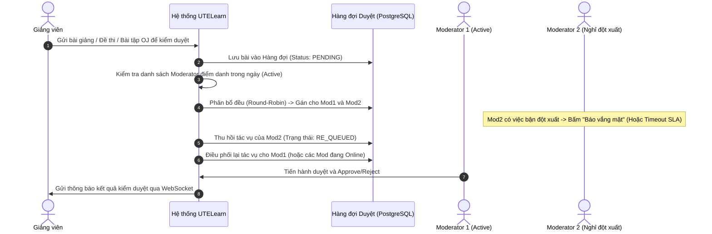

# SOFTWARE REQUIREMENTS SPECIFICATION (SRS)
# UTELearn: NỀN TẢNG KINH DOANH KHÓA HỌC TRỰC TUYẾN VÀ QUẢN LÝ HỌC TẬP SỐ THEO ĐỢT

---

## 1. CÔNG NGHỆ SỬ DỤNG
- **Backend Stack:** Spring Boot (Java 17/21), Spring Security (JWT), Spring Data JPA, Spring WebSocket (STOMP).
- **Frontend Stack:** Thymeleaf (Server-Side Rendering), Bootstrap 5 (Responsive UI), JavaScript (Monaco/CodeMirror Editor cho Online Judge).
- **Database:** PostgreSQL (Primary Relational DB - tận dụng `TSRANGE`, `JSONB`, `FOR UPDATE SKIP LOCKED` cho hàng đợi công việc).
- **Hàng đợi & Điều phối (Queue/Worker):** Spring In-Memory Queue / PostgreSQL Advisory Lock & `FOR UPDATE SKIP LOCKED` (Hàng đợi điều phối bài duyệt công bằng).
- **Dịch vụ tích hợp (3rd Party):**
  - **Media & Storage:** Cloudinary (Lưu trữ ảnh thumbnail, video bài giảng, tài liệu số).
  - **Cổng thanh toán:** VNPay / MoMo (Thanh toán học phí / khóa học trực tuyến).
  - **Online Judge Sandbox:** Judge0 API hoặc Docker-based Sandbox cách ly để biên dịch và chấm code.
- **Trạng thái:** In Progress – Active Development.

---

## Chapter 01: Tổng quan về đề tài

### 1.1 Giới thiệu chung
**Dự án:** UTELearn - Nền tảng Kinh doanh khóa học trực tuyến và Quản lý học tập số theo đợt (Cohort-based E-Learning & LMS Platform).

Tài liệu Đặc tả Yêu cầu Phần mềm (SRS) này xác định toàn diện các yêu cầu chức năng và phi chức năng cho hệ thống UTELearn. Hệ thống là sự kết hợp giữa:
1. **Mô hình Khóa học theo Đợt (Cohort-based Learning):** Phân chia rõ ràng giữa Khung giáo trình chuẩn (Master Course) và các Đợt học/Lớp học cụ thể (Cohorts/Classes) có giảng viên phụ trách, lịch mở bài (Drip Content), hạn chót nộp bài (Deadline) và thảo luận riêng biệt.
2. **Hệ sinh thái Đánh giá toàn diện (Assessment & Online Judge):** Hỗ trợ kiểm tra trắc nghiệm đơn, trắc nghiệm nhiều đáp án, điền khuyết, tự luận và bài tập lập trình chấm điểm tự động (OJ).
3. **Cơ chế Phân quyền động (Dynamic RBAC):** Cung cấp khả năng tùy biến vai trò và danh sách quyền hạn không cố định trong mã nguồn.
4. **Hệ thống Kiểm duyệt Phân bổ Công việc theo Hàng đợi (Fair Queue Moderation):** Tự động điều phối nội dung cần kiểm duyệt cho đội ngũ Moderator đồng đều theo ngày, có cơ chế tự động thu hồi và phân bổ lại (Failover Reassignment) nếu người duyệt nghỉ đột xuất.
5. **Kho Tài nguyên Số Cá nhân cho Giảng viên (Instructor Digital Asset Library):** Không gian lưu trữ độc lập cho từng giảng viên để quản lý, tái sử dụng tài nguyên (slide, video, test case, đề bài) trên nhiều lớp học.

### 1.2 Phạm vi của dự án (Scope Boundary)
- **Thanh toán:** Tích hợp cổng thanh toán trực tuyến (VNPay/MoMo) để xử lý học phí theo từng đợt học/lớp học.
- **Quản lý Media:** Tích hợp Cloudinary để tối ưu hóa lưu trữ và streaming video an toàn qua URL có chữ ký (Signed URLs).
- **Điều phối kiểm duyệt:** Hệ thống sử dụng cơ chế Hàng đợi (Queue) đảm bảo cân bằng tải công việc giữa các nhân sự kiểm duyệt theo ngày công thực tế.
- **Môi trường thực thi code (OJ):** Code nộp của học viên được biên dịch và thực thi độc lập trong môi trường Sandbox cô lập.

### 1.3 Quy ước tài liệu
- **MUST (BẮT BUỘC):** Yêu cầu bắt buộc cho phiên bản hoàn chỉnh của đề tài.
- **SHOULD (NÊN CÓ):** Tính năng quan trọng, tạo giá trị khác biệt cho hệ thống.
- **COULD (CÓ THỂ CÓ):** Tính năng mở rộng nâng cao trải nghiệm (Gamification, gợi ý học tập).
- **WON'T (CHƯA TRIỂN KHAI):** Giám sát thi bằng AI/Proctoring qua webcam thời gian thực.

### 1.4 Quy ước viết tắt
- **RBAC:** Role-Based Access Control (Kiểm soát truy cập dựa trên vai trò).
- **LMS:** Learning Management System (Hệ thống quản lý học tập).
- **OJ:** Online Judge (Hệ thống chấm mã nguồn tự động).
- **DAM:** Digital Asset Management (Hệ thống quản lý tài sản số).
- **FIFO / RR:** First-In, First-Out / Round-Robin (Thuật toán hàng đợi xoay vòng).

### 1.5 Các nhóm đối tượng người dùng (Actors)
| Nhóm người dùng | Mô tả vai trò và chức năng chính |
| :--- | :--- |
| **Guest** | Tìm kiếm khóa học, xem đề cương công khai, đăng ký tài khoản. |
| **Student (Học viên)** | Mua khóa theo đợt, xem bài giảng theo lịch mở, làm bài tập trắc nghiệm/OJ, tương tác lớp học qua WebSocket. |
| **Instructor (Giảng viên)** | Quản lý kho tài nguyên cá nhân (Asset Library), soạn thảo khóa học, mở lớp/đợt học, chấm bài tự luận. |
| **Content Moderator (Người duyệt nội dung)** | Nhận nhiệm vụ duyệt bài giảng, video, đề thi được phân bổ tự động từ hàng đợi (Queue), phê duyệt hoặc từ chối nội dung. |
| **Teaching Assistant (Trợ giảng)** | Hỗ trợ giải đáp thắc mắc lớp học qua WebSocket, chấm bài tự luận dưới quyền của Giảng viên. |
| **Admin (Quản trị viên)** | Quản trị phân quyền động (tạo Role, gán Permission), cấu hình thuật toán chia queue duyệt bài, đối soát doanh thu. |

---

## 1.6 Yêu cầu chức năng (Functional Requirements)

### 1.6.1 Xác thực & Phân quyền động (Dynamic RBAC)
| ID | Nghiệp vụ & Tiêu chí kỹ thuật | Priority | Actor |
| :--- | :--- | :--- | :--- |
| **FR-AUTH-01** | **Xác thực JWT:** Cấp phát Access Token và Refresh Token, tích hợp Spring Security bảo vệ API và view Thymeleaf. | MUST | All |
| **FR-AUTH-02** | **Quản lý Phân quyền Động:** Admin có thể tạo Role mới và tick chọn các Permission chi tiết (VD: `COURSE_CREATE`, `CONTENT_APPROVE`, `COHORT_MANAGE`, `CODE_TEST_MANAGE`) lưu trực tiếp trong PostgreSQL mà không cần rebuild lại ứng dụng. | MUST | Admin |
| **FR-AUTH-03** | **Kiểm tra quyền theo ngữ cảnh (Contextual Authorization):** Phân biệt giữa Quyền Toàn cục (System-wide) và Quyền theo Lớp học (VD: User A là Giảng viên ở Lớp 1 nhưng chỉ là Học viên ở Lớp 2). | MUST | System |

### 1.6.2 Cấu trúc Khóa học & Mô hình Lớp học theo đợt (Cohort-based Model)
| ID | Nghiệp vụ & Tiêu chí kỹ thuật | Priority | Actor |
| :--- | :--- | :--- | :--- |
| **FR-CRS-01** | **Khóa học Khung (Master Course):** Giảng viên soạn thảo cấu trúc Chương (Section) và Bài học (Lesson). Khóa học khung đóng vai trò là mẫu giáo trình dùng chung. | MUST | Instructor |
| **FR-CRS-02** | **Thực thể hóa Đợt học (Cohort/Class Run):** Tạo một đợt học cụ thể từ Master Course: Thiết lập khoảng thời gian mở đăng ký (`enrollment_period`), thời gian diễn ra (`study_period`), sĩ số tối đa (`max_capacity`), giảng viên/trợ giảng phụ trách. | MUST | Instructor, Admin |
| **FR-CRS-03** | **Lịch mở bài (Drip Content) & Deadline linh hoạt:** Mỗi lớp có bảng cấu hình lịch riêng: Ngày/giờ bài học được mở khóa (Unlock timestamp) và Hạn chót nộp bài tập/OJ (Deadline timestamp). | MUST | Instructor, Student |
| **FR-CRS-04** | **Kiểm soát sĩ số đồng thời:** Sử dụng khóa bi quan (`PESSIMISTIC_WRITE`) của JPA trên PostgreSQL để ngăn chặn tình trạng quá sĩ số lớp khi thanh toán ghi danh đồng thời. | MUST | System |

### 1.6.3 Kho Tài nguyên Số Cá nhân của Giảng viên (Instructor Digital Asset Library)
| ID | Nghiệp vụ & Tiêu chí kỹ thuật | Priority | Actor |
| :--- | :--- | :--- | :--- |
| **FR-AST-01** | **Kho lưu trữ riêng biệt:** Mỗi Giảng viên sở hữu một kho tài nguyên cá nhân để lưu trữ tài liệu (PDF, Word, Slide), Video bài giảng gốc, File mẫu mã nguồn, Bộ test case cho OJ. | MUST | Instructor |
| **FR-AST-02** | **Tái sử dụng nội dung (Content Reusability):** Khi soạn bài học cho bất kỳ Khóa học hoặc Lớp học nào, Giảng viên có thể chọn trực tiếp từ Kho tài nguyên cá nhân mà không phải upload lại tệp lên Cloudinary, tránh lãng phí dung lượng và thời gian. | MUST | Instructor |
| **FR-AST-03** | **Quản lý thư mục & Phân quyền chia sẻ:** Cho phép tổ chức cây thư mục, gắn nhãn (tags), và thiết lập trạng thái tài nguyên: *Riêng tư (Private)*, *Chia sẻ nội bộ bộ môn (Department Shared)*, hoặc *Công khai cho lớp (Cohort Public)*. | SHOULD | Instructor |

### 1.6.4 Hệ thống Điều phối & Kiểm duyệt Nội dung theo Hàng đợi Công bằng (Fair Queue Dispatcher)
| ID | Nghiệp vụ & Tiêu chí kỹ thuật | Priority | Actor |
| :--- | :--- | :--- | :--- |
| **FR-MOD-01** | **Điểm danh ca trực duyệt bài:** Mỗi ngày, các Moderator điểm danh/bật trạng thái `ACTIVE_TODAY` để ghi nhận sẵn sàng làm việc. | MUST | Moderator |
| **FR-MOD-02** | **Phân bổ công việc đều bằng Hàng đợi (Fair Dispatching Queue):** Khi Giảng viên gửi duyệt bài học mới/đề thi/bài tập OJ, yêu cầu được đẩy vào Queue trung tâm. Hệ thống sử dụng thuật toán Round-Robin / Cân bằng tải trọng số (Weighted Load Balancing) để chia đều số lượng tác vụ cho các Moderator đang `ACTIVE` trong ngày. | MUST | System |
| **FR-MOD-03** | **Cơ chế Xử lý Vắng mặt Đột xuất (Failover & Re-queue):**  - Khi một Moderator bấm báo *Nghỉ đột xuất* hoặc một tác vụ được gán bị quá hạn (SLA Timeout) mà chưa được xử lý. - Hệ thống tự động thu hồi (Revoke) toàn bộ các mục chưa duyệt của người đó, đưa ngược lại về đầu hàng đợi ưu tiên (Priority Re-queue) và phân phối lại đồng đều cho các Moderator còn lại đang online, đảm bảo tiến độ không bị ách tắc. | MUST | System, Moderator |
| **FR-MOD-04** | **Phê duyệt theo từng lớp/khóa học:** Moderator kiểm tra nội dung video, tệp tài liệu, tính đúng đắn của Test Case OJ. Cho phép duyệt (Approve) hoặc từ chối có kèm lý do phản hồi (Reject with Feedback). | MUST | Moderator |

### 1.6.5 Hệ thống Kiểm tra Đa dạng & Online Judge (Assessment & OJ)
| ID | Nghiệp vụ & Tiêu chí kỹ thuật | Priority | Actor |
| :--- | :--- | :--- | :--- |
| **FR-EXM-01** | **Đa dạng loại câu hỏi:** Hỗ trợ tạo đề kiểm tra gồm: (1) Trắc nghiệm một đáp án, (2) Trắc nghiệm chọn nhiều đáp án (Checkbox), (3) Điền khuyết (Fill-in-the-blank), (4) Tự luận (Essay). | MUST | Instructor |
| **FR-EXM-02** | **Chấm điểm tự động & Thủ công:** Tự động chấm các câu trắc nghiệm và điền khuyết. Cung cấp giao diện chấm bài tự luận cho Giảng viên/Trợ giảng kèm thang điểm chi tiết (Rubric). | MUST | System, Instructor |
| **FR-EXM-03** | **Hệ thống Online Judge (OJ):** Bài tập lập trình tích hợp Monaco Editor trên trình duyệt. Học viên nộp code (Java, Python, C++), hệ thống gọi sang Sandbox cách ly để biên dịch và chạy qua bộ Test Cases (gồm Test công khai và Test ẩn). Trả về kết quả: `Accepted (AC)`, `Wrong Answer (WA)`, `Time Limit Exceeded (TLE)`, `Memory Limit Exceeded (MLE)`, `Compile Error (CE)`. | MUST | Student, System |

### 1.6.6 Tương tác & Thông báo Thời gian thực (WebSocket)
| ID | Nghiệp vụ & Tiêu chí kỹ thuật | Priority | Actor |
| :--- | :--- | :--- | :--- |
| **FR-RTC-01** | **Kênh trao đổi nội bộ theo Lớp học:** Mỗi lớp học (Cohort) có một phòng chat/Q&A WebSocket độc lập. Học viên lớp này không thấy thảo luận của lớp khác. | MUST | Student, Instructor |
| **FR-RTC-02** | **Thông báo đẩy Realtime:** Thông báo tức thì khi có bài học mới mở, thông báo khi bài tập OJ được chấm xong, thông báo cho Moderator khi có bài cần duyệt được gán vào hòm thư công việc. | MUST | All |

---

## 1.7 Yêu cầu phi chức năng (Non-Functional Requirements)
| ID | Tiêu chí | Mô tả chi tiết & Nghiệp vụ kiểm thử |
| :--- | :--- | :--- |
| **NFR-SEC-01** | **Bảo mật Sandbox OJ** | Mã nguồn học viên nộp **tuyệt đối không** được thực thi trực tiếp trên server chính. Phải chạy trong Container cô lập, giới hạn 1 vCPU, 256MB RAM, tắt kết nối mạng internet và timeout tối đa 2000ms. |
| **NFR-QUE-01** | **Tính nhất quán của Hàng đợi** | Cơ chế phân phối bài duyệt sử dụng `FOR UPDATE SKIP LOCKED` trong PostgreSQL để đảm bảo hai Moderator không bao giờ nhận trùng cùng một bài duyệt trong điều kiện môi trường concurrency cao. |
| **NFR-PER-01** | **Tối ưu hóa Truy vấn PostgreSQL** | Tận dụng Index trên các cột tìm kiếm thường xuyên (`cohort_id`, `user_id`, `status`). Sử dụng kiểu `JSONB` có đánh chỉ mục GIN cho các cấu trúc đáp án câu hỏi phức tạp. |
| **NFR-AVA-01** | **Tính sẵn sàng của Video** | Video lưu trữ trên Cloudinary phải được phân phối qua CDN với độ sẵn sàng cao, hỗ trợ tự động điều chỉnh độ phân giải phù hợp với băng thông mạng của học viên. |

---

## Chapter 02: Phân tích thiết kế hệ thống

### 2.1 Kiến trúc hệ thống tổng quan
Hệ thống được thiết kế theo mô hình **Layered Monolithic Architecture** tối ưu hóa trên nền tảng **Spring Boot**, kết hợp các dịch vụ phụ trợ cách ly:
- **Presentation Layer (Thymeleaf + Bootstrap + JS):** Render giao diện từ máy chủ, tích hợp WebSocket Client (STOMP.js) và Monaco Code Editor.
- **Application Layer (Spring Boot Core):**
  - *Dynamic Security Manager:* Nạp và thẩm định quyền truy cập từ DB thông qua JWT.
  - *Moderation Queue Dispatcher:* Service chạy ngầm phân bổ và thu hồi bài duyệt.
  - *OJ Execution Manager:* Đóng gói mã nguồn và gọi sang Sandbox.
- **Data Layer (PostgreSQL):** Đảm bảo chuẩn giao dịch ACID cho thanh toán, quản lý thời gian đợt học bằng `TSRANGE`, và hàng đợi công việc không khóa trùng lặp bằng `SKIP LOCKED`.
- **Media CDN (Cloudinary):** Lưu trữ toàn bộ dữ liệu đa phương tiện từ Kho tài nguyên giảng viên.

---

### 2.2 Sơ đồ Luồng Điều phối Kiểm duyệt Nội dung (Queue Dispatching Flow)

---

### 2.3 Thiết kế Cơ sở Dữ liệu Mức Khái niệm (Entity Schema)

#### 1. Nhóm Phân quyền động (Dynamic RBAC)
- **`users`**: `(id, username, password_hash, email, full_name, is_active, created_at)`
- **`roles`**: `(id, code, name, description)` *(VD: ROLE_ADMIN, ROLE_MODERATOR, ROLE_INSTRUCTOR, ROLE_STUDENT)*
- **`permissions`**: `(id, code, name, module)` *(VD: COURSE_CREATE, MODERATION_APPROVE, ASSET_MANAGE)*
- **`role_permissions`**: `(role_id, permission_id)` $\rightarrow$ Bảng trung gian gán quyền cho vai trò.
- **`user_roles`**: `(user_id, role_id)` $\rightarrow$ Bảng trung gian gán vai trò cho người dùng.

#### 2. Nhóm Khóa học & Đợt học (Master Course & Cohort Model)
- **`courses`**: `(id, code, title, slug, description, instructor_id, category_id, status)` *(Master Course)*
- **`sections`**: `(id, course_id, title, order_index)`
- **`lessons`**: `(id, section_id, title, lesson_type, order_index, is_free_preview)` *(Type: VIDEO, DOCUMENT, QUIZ, CODE)*
- **`cohorts`**: `(id, course_id, code, name, enrollment_period TSRANGE, study_period TSRANGE, max_capacity, price, status)`
- **`cohort_members`**: `(id, cohort_id, user_id, role_in_cohort, enrolled_at, final_grade, is_passed)`
- **`cohort_schedules`**: `(id, cohort_id, lesson_id, unlock_at, deadline_at)` $\rightarrow$ Lịch mở bài và hạn nộp theo từng lớp.

#### 3. Nhóm Kho Tài nguyên Số Giảng viên (Instructor Digital Asset Library)
- **`instructor_assets`**: Lưu trữ tệp tin cá nhân của giảng viên:
  - `id`: Khóa chính.
  - `instructor_id`: FK $\rightarrow$ `users(id)`.
  - `name`: Tên tệp hiển thị.
  - `asset_type`: `VIDEO`, `DOCUMENT`, `SLIDE`, `CODE_TEMPLATE`, `TESTCASE_ARCHIVE`.
  - `cloudinary_url`: Đường dẫn lưu trữ Cloudinary.
  - `file_size_bytes`: Kích thước tệp.
  - `visibility`: `PRIVATE`, `DEPARTMENT_SHARED`, `COHORT_PUBLIC`.
  - `folder_path`: Đường dẫn thư mục quản lý (VD: `/JavaBasic/Week01/`).
  - `created_at`, `updated_at`.

#### 4. Nhóm Hàng đợi Điều phối Kiểm duyệt (Moderation Queue & Attendance)
- **`moderator_attendances`**: Quản lý ca trực kiểm duyệt theo ngày:
  - `id`: Khóa chính.
  - `moderator_id`: FK $\rightarrow$ `users(id)`.
  - `work_date`: Ngày làm việc (`DATE`).
  - `is_active`: `TRUE` (đang trực), `FALSE` (nghỉ/vắng mặt).
  - `max_quota`: Số lượng bài duyệt tối đa trong ngày.
- **`moderation_tasks`**: Hàng đợi kiểm duyệt nội dung:
  - `id`: Khóa chính.
  - `item_type`: `LESSON`, `QUIZ`, `CODING_PROBLEM`.
  - `item_id`: Khóa ngoại trỏ đến đối tượng cần duyệt.
  - `cohort_id`: FK $\rightarrow$ `cohorts(id)` (nếu duyệt nội dung cho lớp cụ thể).
  - `assigned_to`: FK $\rightarrow$ `users(id)` (Moderator được phân bổ).
  - `status`: `PENDING`, `ASSIGNED`, `IN_REVIEW`, `APPROVED`, `REJECTED`, `RE_QUEUED`.
  - `assigned_at`, `deadline_at`: Thời hạn Moderator phải duyệt xong (SLA Timeout).
  - `feedback`: Nhận xét lý do nếu từ chối.

#### 5. Nhóm Đánh giá & Online Judge (Assessment & OJ)
- **`quizzes`**: `(id, lesson_id, title, duration_minutes, passing_score)`
- **`questions`**: `(id, quiz_id, content, question_type, points, options_json JSONB)` *(Type: SINGLE, MULTI, FILL_BLANK, ESSAY)*
- **`coding_problems`**: `(id, lesson_id, problem_title, statement_markdown, allowed_languages, time_limit_ms, memory_limit_mb, starter_code)`
- **`coding_test_cases`**: `(id, coding_problem_id, input_data, expected_output, is_hidden, points)`
- **`coding_submissions`**: `(id, coding_problem_id, user_id, cohort_id, source_code, language, status, execution_time_ms, memory_used_kb, score, log_output)`
