# UC00 – Biểu đồ Use Case Tổng Quan Hệ Thống UTELearn

## 1. Mô hình kiến trúc nghiệp vụ Course - Cohort

Hệ thống áp dụng mô hình phân cấp đào tạo **Course - Cohort**:
- **Course (Khóa học lớn)**: Đóng vai trò là chương trình tổng thể, chứa thông tin định danh (tiêu đề, danh mục, giảng viên phụ trách, giới thiệu, giá bán trọn gói - Full Course). Một Course bao gồm một hoặc nhiều Cohort.
- **Cohort (Lớp học / Module thành phần)**: Là đơn vị học tập cụ thể nằm trong Course. Mỗi Cohort có giáo trình riêng (Section, Lesson, Quiz), lịch học, sĩ số, kênh thảo luận WebSocket, và giá bán riêng lẻ.
- **Chính sách mua học tập**:
  - Học viên có thể chọn mua **Full Course** (sở hữu toàn bộ các Cohort với mức giá ưu đãi trọn gói).
  - Học viên có thể chọn mua **1 hoặc nhiều Cohort riêng lẻ** theo nhu cầu học tập.
  - Học viên đã mua một số Cohort có thể **Nâng cấp (Upgrade)** lên Full Course bằng cách thanh toán phần giá trị chênh lệch.

---

## 2. Use Case Diagram Tổng Quan

```mermaid
graph TB
    subgraph Actors["Tác nhân (Actors)"]
        Guest["Guest<br/>(Khách vãng lai)"]
        Student["Student<br/>(Học viên)"]
        TA["TA<br/>(Trợ giảng)"]
        Instructor["Instructor<br/>(Giảng viên)"]
        Moderator["Moderator<br/>(Kiểm duyệt viên)"]
        Admin["Admin<br/>(Quản trị viên)"]
    end

    subgraph UC_Auth["Module 1: Authentication & Authorization"]
        UC01["UC-01: Đăng nhập"]
        UC02["UC-02: Đăng ký tài khoản"]
        UC03["UC-03: Đăng nhập Google OAuth2"]
        UC04["UC-04: Đăng xuất"]
        UC05["UC-05: Quên mật khẩu"]
        UC06["UC-06: Đặt lại mật khẩu"]
        UC07["UC-07: Cập nhật hồ sơ cá nhân"]
    end

    subgraph UC_Admin["Module 2: Quản trị Hệ thống (Admin)"]
        UC08["UC-08: Quản lý tài khoản người dùng"]
        UC09["UC-09: Cấu hình phân quyền động RBAC"]
        UC10["UC-10: Xem Dashboard thống kê toàn diện"]
        UC11["UC-11: Quản lý danh mục khóa học"]
        UC12["UC-12: Quản lý điểm danh Moderator"]
    end

    subgraph UC_Course["Module 3: Quản lý Khóa học (Course)"]
        UC13["UC-13: Tạo khóa học mới"]
        UC14["UC-14: Chỉnh sửa thông tin khóa học"]
        UC15["UC-15: Gửi xuất bản khóa học"]
        UC16["UC-16: Quản lý danh mục & cấu trúc Course"]
        UC17["UC-17: Cấu hình giá trọn gói Course"]
    end

    subgraph UC_Cohort["Module 4: Quản lý Cohort (Lớp học / Module)"]
        UC33["UC-33: Tạo Cohort trong Course"]
        UC34["UC-34: Mua lẻ Cohort / Nâng cấp Full Course"]
        UC35["UC-35: Chat thảo luận Cohort (WebSocket)"]
        UC36["UC-36: Quản lý lịch học Cohort"]
        UC37["UC-37: Soạn giáo trình & đề kiểm tra Cohort"]
    end

    subgraph UC_Student["Module 5: Học trực tuyến (Student)"]
        UC21["UC-21: Duyệt / Tìm kiếm Course & Cohort"]
        UC22["UC-22: Đăng ký / Thanh toán khóa học"]
        UC23["UC-23: Học bài giảng theo Cohort"]
        UC24["UC-24: Làm bài kiểm tra theo Cohort"]
        UC25["UC-25: Xem tiến độ học tập & gợi ý nâng cấp"]
    end

    subgraph UC_Moderation["Module 6: Kiểm duyệt Nội dung"]
        UC18["UC-18: Xem hàng đợi duyệt nội dung"]
        UC19["UC-19: Phê duyệt / Từ chối khóa học"]
        UC20["UC-20: Gửi nhận xét phản hồi kiểm duyệt"]
    end

    subgraph UC_Asset["Module 7: Kho Tài nguyên số (Digital Assets)"]
        UC30["UC-30: Upload tài nguyên số"]
        UC31["UC-31: Quản lý kho tài nguyên"]
        UC32["UC-32: Tải tài nguyên theo bài học"]
    end

    subgraph UC_OJ["Module 8: Online Judge (DINH HUONG PHAT TRIEN)"]
        UC26["UC-26: Xem đề bài lập trình OJ"]
        UC27["UC-27: Nộp bài mã nguồn chấm tự động"]
        UC28["UC-28: Xem kết quả chấm test case"]
        UC29["UC-29: Soạn đề bài lập trình OJ"]
    end

    %% Guest connections
    Guest --> UC01
    Guest --> UC02
    Guest --> UC03
    Guest --> UC05
    Guest --> UC21

    %% Student connections
    Student --> UC04
    Student --> UC07
    Student --> UC21
    Student --> UC22
    Student --> UC23
    Student --> UC24
    Student --> UC25
    Student --> UC34
    Student --> UC35
    Student --> UC32
    Student --> UC26
    Student --> UC27
    Student --> UC28

    %% TA connections
    TA --> UC35
    TA --> UC23

    %% Instructor connections
    Instructor --> UC13
    Instructor --> UC14
    Instructor --> UC15
    Instructor --> UC16
    Instructor --> UC17
    Instructor --> UC33
    Instructor --> UC36
    Instructor --> UC37
    Instructor --> UC30
    Instructor --> UC31
    Instructor --> UC29

    %% Moderator connections
    Moderator --> UC18
    Moderator --> UC19
    Moderator --> UC20

    %% Admin connections
    Admin --> UC08
    Admin --> UC09
    Admin --> UC10
    Admin --> UC11
    Admin --> UC12
```

---

## 3. Danh mục Use Case theo Phân hệ

| Mã UC | Tên Use Case | Phân hệ | Actor chính | Ghi chú |
|-------|--------------|---------|-------------|---------|
| **UC-01** | Đăng nhập bằng Email/Password | Authentication | Guest | Cấp Cookie JWT |
| **UC-02** | Đăng ký tài khoản mới | Authentication | Guest | Mặc định gán role STUDENT |
| **UC-03** | Đăng nhập qua Google OAuth2 | Authentication | Guest | Tự động đồng bộ tài khoản |
| **UC-04** | Đăng xuất | Authentication | User | Hủy Cookie JWT & Session |
| **UC-05** | Quên mật khẩu | Authentication | Guest | Gửi email liên kết xác thực |
| **UC-06** | Đặt lại mật khẩu | Authentication | Guest | Xác thực token qua URL |
| **UC-07** | Cập nhật hồ sơ cá nhân | User Profile | User | Họ tên, avatar, liên hệ |
| **UC-08** | Quản lý tài khoản người dùng | Quản trị Hệ thống | Admin | Kích hoạt, khóa, phân vai trò |
| **UC-09** | Cấu hình phân quyền động RBAC | Quản trị Hệ thống | Admin | Ánh xạ quyền cho vai trò |
| **UC-10** | Xem Dashboard thống kê | Quản trị Hệ thống | Admin | Doanh thu, số lượng học viên |
| **UC-11** | Quản lý danh mục khóa học | Quản trị Hệ thống | Admin | Phân loại Category đa cấp |
| **UC-12** | Quản lý điểm danh Moderator | Quản trị Hệ thống | Admin | Giám sát ca làm việc, SLA |
| **UC-13** | Tạo khóa học mới | Quản lý Khóa học | Instructor | Thiết lập thông tin và giá Full Course |
| **UC-14** | Chỉnh sửa thông tin khóa học | Quản lý Khóa học | Instructor | Cập nhật tiêu đề, mô tả, media |
| **UC-15** | Gửi xuất bản khóa học | Quản lý Khóa học | Instructor | Đẩy vào hàng đợi kiểm duyệt |
| **UC-16** | Quản lý danh mục & cấu trúc Course | Quản lý Khóa học | Instructor | Gắn category, quản lý danh sách Cohort |
| **UC-17** | Cấu hình giá trọn gói Course | Quản lý Khóa học | Instructor | Thiết lập ưu đãi gói tổng thể |
| **UC-18** | Xem hàng đợi duyệt nội dung | Kiểm duyệt Nội dung | Moderator | Lọc task, phân bổ tải |
| **UC-19** | Phê duyệt / Từ chối khóa học | Kiểm duyệt Nội dung | Moderator | Quyết định PUBLISHED hoặc REJECTED |
| **UC-20** | Gửi nhận xét phản hồi kiểm duyệt | Kiểm duyệt Nội dung | Moderator | Phản hồi chi tiết cho Giảng viên |
| **UC-21** | Duyệt / Tìm kiếm Course & Cohort | Học trực tuyến | Guest, Student | Xem thông tin chi tiết và giá bán |
| **UC-22** | Đăng ký / Thanh toán khóa học | Học trực tuyến | Student | Mua Full Course hoặc từng Cohort |
| **UC-23** | Học bài giảng theo Cohort | Học trực tuyến | Student, TA | Video, tài liệu, đánh dấu tiến độ |
| **UC-24** | Làm bài kiểm tra theo Cohort | Học trực tuyến | Student | Trắc nghiệm, tính giờ làm bài |
| **UC-25** | Xem tiến độ học tập & gợi ý nâng cấp | Học trực tuyến | Student | Theo dõi % hoàn thành, ưu đãi Full |
| **UC-26** | Xem đề bài lập trình OJ | Online Judge | Student | **Định hướng phát triển** |
| **UC-27** | Nộp bài mã nguồn chấm tự động | Online Judge | Student | **Định hướng phát triển** |
| **UC-28** | Xem kết quả chấm test case | Online Judge | Student | **Định hướng phát triển** |
| **UC-29** | Soạn đề bài lập trình OJ | Online Judge | Instructor | **Định hướng phát triển** |
| **UC-30** | Upload tài nguyên số | Kho Tài nguyên | Instructor | Tải lên PDF, Video, Slide |
| **UC-31** | Quản lý kho tài nguyên | Kho Tài nguyên | Instructor | Xem, gắn thẻ, xóa tệp |
| **UC-32** | Tải tài nguyên theo bài học | Kho Tài nguyên | Student | Tải tài liệu đính kèm |
| **UC-33** | Tạo Cohort trong Course | Quản lý Cohort | Instructor | Thiết lập tên, giá riêng, lịch mở |
| **UC-34** | Mua lẻ Cohort / Nâng cấp Full Course | Quản lý Cohort | Student | Chọn mua 1 hoặc nhiều Cohort, bù chênh lệch |
| **UC-35** | Chat thảo luận Cohort (WebSocket) | Quản lý Cohort | Student, TA | Trao đổi thời gian thực theo lớp |
| **UC-36** | Quản lý lịch học Cohort | Quản lý Cohort | Instructor | Lịch mở bài học, deadline, giờ học |
| **UC-37** | Soạn giáo trình & đề kiểm tra Cohort | Quản lý Cohort | Instructor | Quản lý Section, Lesson, Quiz theo Cohort |

---

## 4. Nguyên tắc phân quyền truy cập (Access Control)

- **Guest (Khách vãng lai)**: Truy cập trang chủ `/home`, danh sách khóa học `/courses`, chi tiết khóa học `/courses/{slug}`, đăng nhập `/login`, đăng ký `/register`.
- **Student (Học viên)**: Truy cập trang cá nhân `/profile`, khu vực học tập `/student/**`, chi tiết lớp đã mua, nộp bài, thảo luận chat WebSocket.
- **Instructor (Giảng viên)**: Toàn quyền quản trị nội dung giảng dạy tại `/instructor/**`, quản lý Course, thêm Cohort, biên soạn Section/Lesson, tải tài nguyên.
- **TA (Trợ giảng)**: Tham gia hỗ trợ giải đáp trong các Cohort được phân công `/cohort/{id}/chat`, hỗ trợ xem nội dung bài giảng.
- **Moderator (Kiểm duyệt viên)**: Truy cập hàng đợi kiểm duyệt tại `/moderator/**`, điểm danh ca trực, phê duyệt/từ chối nội dung.
- **Admin (Quản trị viên)**: Độc quyền khu vực quản trị `/admin/**` và `/dashboard`, quản lý người dùng, phân quyền RBAC động, cấu hình danh mục và hệ thống.
