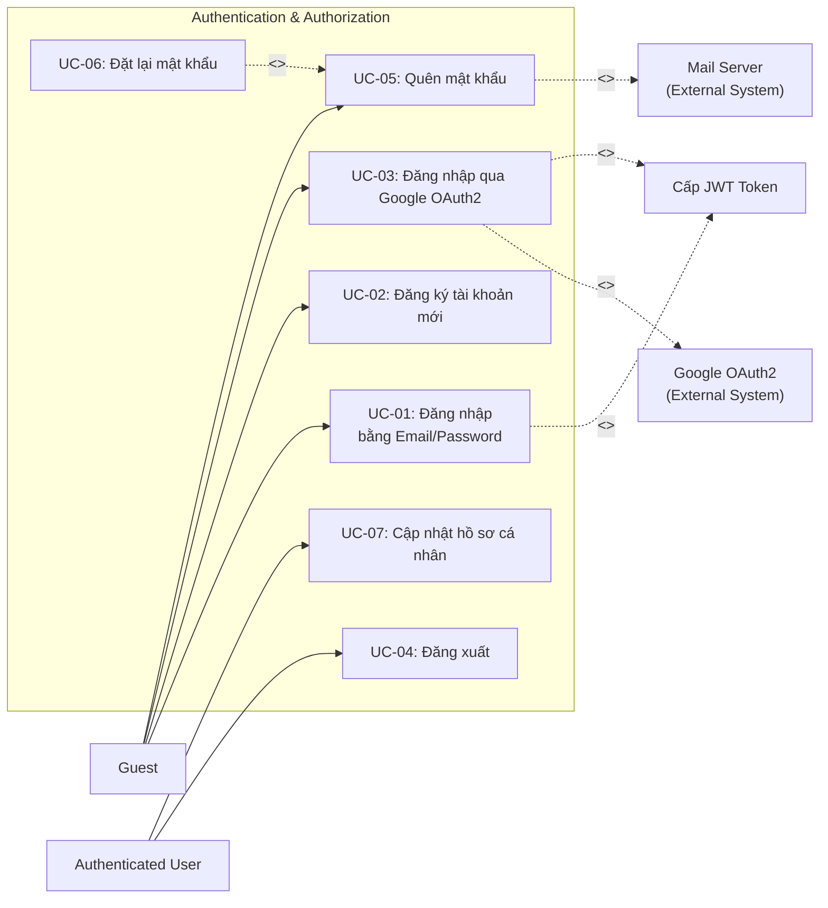

# UC01 – Xác thực & Phân quyền (Authentication & Authorization)

## Use Case Diagram

## Chi tiết Use Case

### UC-01: Đăng nhập bằng Email/Password

| Thuộc tính | Mô tả |
|------------|--------|
| **Actor** | Guest |
| **Mô tả** | Người dùng đăng nhập bằng email và mật khẩu đã đăng ký |
| **Tiền điều kiện** | Đã có tài khoản trong hệ thống |
| **Luồng chính** | 1. Guest truy cập `/login`   2. Nhập email và password   3. Hệ thống xác thực thông tin   4. Cấp JWT Token lưu vào Cookie `UTELearn_Token`   5. Redirect theo role: Admin -> `/dashboard`, Others -> `/home` |
| **Luồng ngoại lệ** | - Sai mật khẩu -> Hiển thị lỗi   - Tài khoản bị khóa -> Thông báo liên hệ admin |
| **Hậu điều kiện** | User đã đăng nhập, JWT Token hợp lệ |

### UC-02: Đăng ký tài khoản mới

| Thuộc tính | Mô tả |
|------------|--------|
| **Actor** | Guest |
| **Mô tả** | Tạo tài khoản mới với email, mật khẩu và xác nhận mật khẩu |
| **Tiền điều kiện** | Chưa có tài khoản |
| **Luồng chính** | 1. Guest truy cập `/register`   2. Nhập email, password, confirm password   3. Hệ thống validate (email unique, password match)   4. Tạo user với role mặc định `STUDENT`   5. Tự động đăng nhập và redirect -> `/home` |
| **Luồng ngoại lệ** | - Email đã tồn tại -> Thông báo lỗi   - Password không khớp -> Hiển thị lỗi validation |
| **Hậu điều kiện** | Tài khoản mới được tạo với role STUDENT |

### UC-03: Đăng nhập qua Google OAuth2

| Thuộc tính | Mô tả |
|------------|--------|
| **Actor** | Guest |
| **Mô tả** | Đăng nhập bằng tài khoản Google, hệ thống tự động tạo tài khoản nếu chưa có |
| **Tiền điều kiện** | Có tài khoản Google hợp lệ |
| **Luồng chính** | 1. Guest click "Đăng nhập với Google"   2. Redirect đến Google OAuth2 consent screen   3. Xác thực thành công -> Callback về hệ thống   4. Hệ thống kiểm tra email, tự tạo account nếu cần   5. Cấp JWT Token -> Redirect theo role |
| **Luồng ngoại lệ** | - Từ chối ủy quyền -> Quay lại `/login` |
| **Hậu điều kiện** | User đăng nhập thành công |

### UC-04: Đăng xuất

| Thuộc tính | Mô tả |
|------------|--------|
| **Actor** | Authenticated User (tất cả roles) |
| **Mô tả** | Thoát khỏi phiên làm việc hiện tại |
| **Luồng chính** | 1. Click "Đăng xuất"   2. Xóa cookie `UTELearn_Token` và `JSESSIONID`   3. Redirect -> `/login?logout=true` |
| **Hậu điều kiện** | JWT Token bị xóa, session kết thúc |

### UC-05: Quên mật khẩu

| Thuộc tính | Mô tả |
|------------|--------|
| **Actor** | Guest |
| **Mô tả** | Yêu cầu reset mật khẩu qua email |
| **Luồng chính** | 1. Guest truy cập `/forgot-password`   2. Nhập email đã đăng ký   3. Hệ thống tạo token reset và gửi email   4. Hiển thị thông báo "Đã gửi email" |
| **Luồng ngoại lệ** | - Email không tồn tại -> Vẫn hiển thị thông báo (bảo mật) |

### UC-06: Đặt lại mật khẩu

| Thuộc tính | Mô tả |
|------------|--------|
| **Actor** | Guest (có token hợp lệ) |
| **Mô tả** | Đặt mật khẩu mới thông qua link reset |
| **Luồng chính** | 1. Click link trong email `/reset-password?token=xxx`   2. Nhập mật khẩu mới và xác nhận   3. Hệ thống validate token và cập nhật password   4. Redirect -> `/login` |
| **Luồng ngoại lệ** | - Token hết hạn hoặc không hợp lệ -> Thông báo lỗi |

### UC-07: Cập nhật hồ sơ cá nhân

| Thuộc tính | Mô tả |
|------------|--------|
| **Actor** | Authenticated User |
| **Mô tả** | Cập nhật thông tin cá nhân (họ tên, SĐT, avatar...) |
| **Luồng chính** | 1. Truy cập `/profile`   2. Chỉnh sửa thông tin (fullName, phone, avatar)   3. Submit form -> Validate -> Lưu DB   4. Hiển thị toast thành công |
| **Hậu điều kiện** | Thông tin profile được cập nhật |
