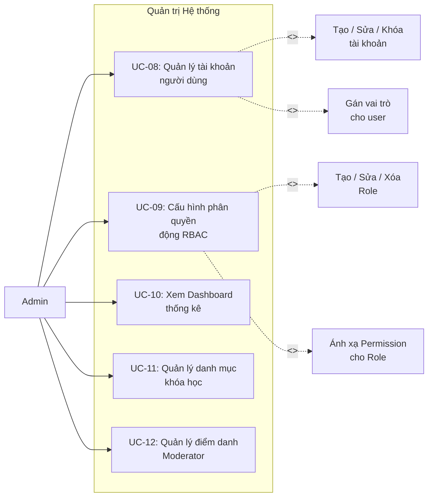

# UC02 – Quản trị Hệ thống (Admin Module)

## Use Case Diagram

## Chi tiết Use Case

### UC-08: Quản lý tài khoản người dùng

| Thuộc tính | Mô tả |
|------------|--------|
| **Actor** | Admin |
| **Permission** | `USER_MANAGE` |
| **Mô tả** | CRUD tài khoản, gán vai trò, kích hoạt / khóa tài khoản |
| **Tiền điều kiện** | Admin đã đăng nhập, có quyền `USER_MANAGE` |
| **Luồng chính** | 1. Admin truy cập `/admin/users`   2. Xem danh sách user (phân trang, tìm kiếm)   3. Click vào user -> Xem / Sửa thông tin   4. Gán / Gỡ vai trò   5. Kích hoạt / Vô hiệu hóa tài khoản |
| **Hậu điều kiện** | Thông tin user được cập nhật trong DB |

### UC-09: Cấu hình phân quyền động RBAC

| Thuộc tính | Mô tả |
|------------|--------|
| **Actor** | Admin |
| **Permission** | `ROLE_MANAGE` |
| **Mô tả** | Quản lý Roles và Permissions, ánh xạ permission cho từng role |
| **Luồng chính** | 1. Admin truy cập `/admin/roles`   2. Xem danh sách Role hiện có   3. Tạo mới / Chỉnh sửa Role   4. Tick chọn các Permission áp dụng cho Role   5. Lưu -> Hệ thống cập nhật bảng `role_permissions` |
| **Luồng ngoại lệ** | - Xóa role đang được gán -> Cảnh báo |

### UC-10: Xem Dashboard thống kê

| Thuộc tính | Mô tả |
|------------|--------|
| **Actor** | Admin |
| **Mô tả** | Xem tổng quan hệ thống: số user, khóa học, doanh thu, hoạt động |
| **Luồng chính** | 1. Admin truy cập `/dashboard`   2. Hệ thống hiển thị KPIs:   - Tổng số user, instructor, student   - Số khóa học (theo trạng thái)   - Doanh thu (nếu có)   - Hoạt động gần đây |

### UC-11: Quản lý danh mục khóa học

| Thuộc tính | Mô tả |
|------------|--------|
| **Actor** | Admin |
| **Mô tả** | CRUD danh mục (Category) cho khóa học |
| **Luồng chính** | 1. Admin truy cập quản lý danh mục   2. Thêm / Sửa / Xóa category   3. Mỗi category có `name` và `slug` |

### UC-12: Quản lý điểm danh Moderator

| Thuộc tính | Mô tả |
|------------|--------|
| **Actor** | Admin |
| **Mô tả** | Theo dõi và quản lý bảng điểm danh của Moderator |
| **Luồng chính** | 1. Admin truy cập `/admin/attendance`   2. Xem danh sách điểm danh theo ngày/tuần   3. Xác nhận / Từ chối ca làm việc |
