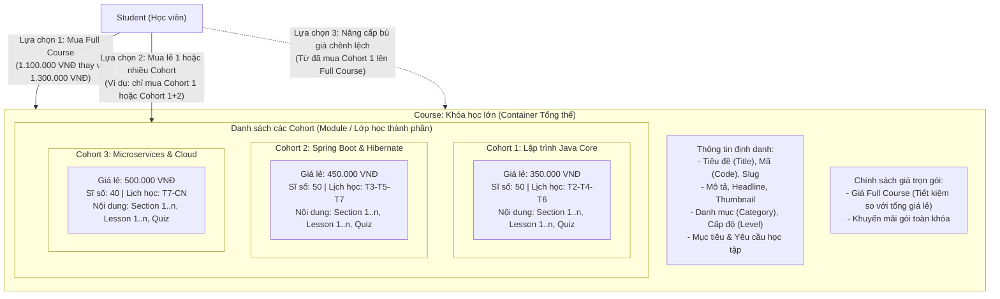
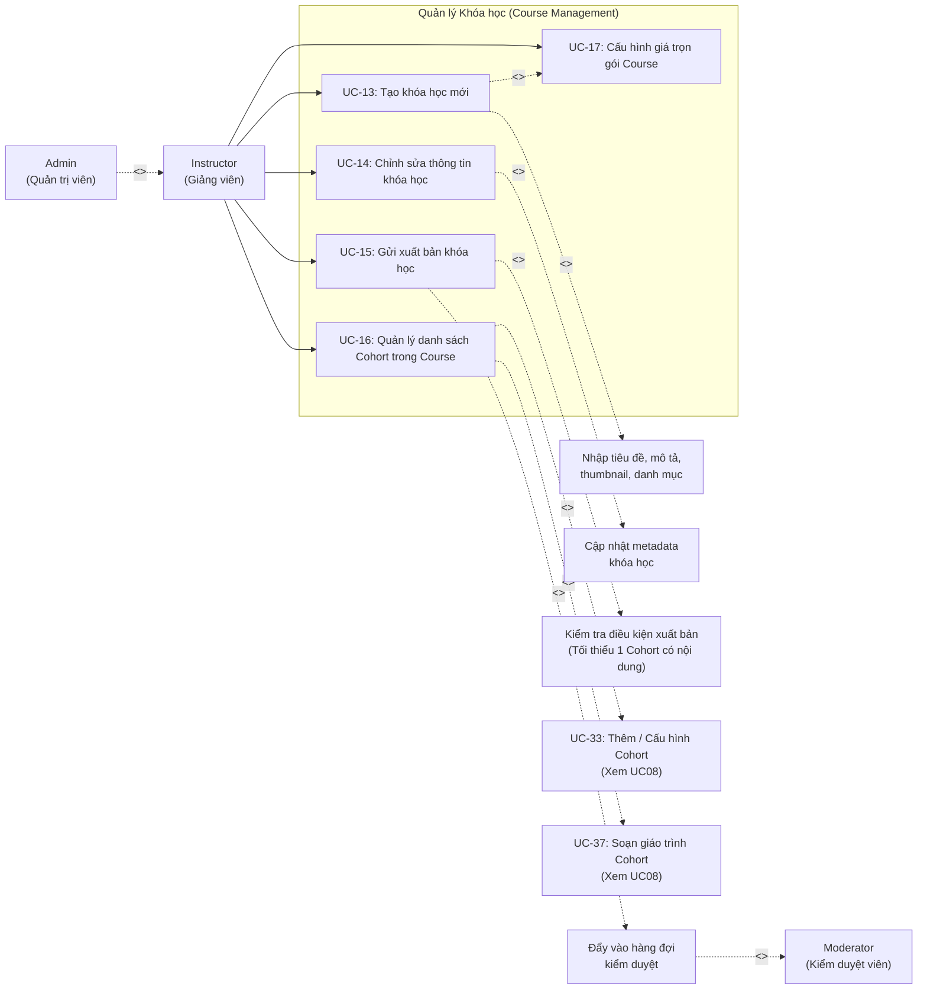

# UC03 – Quản lý Khóa học (Course Management – Instructor)

## 1. Mô hình Phân cấp Khóa học & Cohort

---

## 2. Use Case Diagram

---

## 3. Chi tiết Use Case

### UC-13: Tạo khóa học mới

| Thuộc tính | Chi tiết mô tả |
|------------|----------------|
| **Mã Use Case** | UC-13 |
| **Tên Use Case** | Tạo khóa học mới (Create Course Container) |
| **Actor chính** | Instructor |
| **Actor phụ** | Admin (thừa kế quyền) |
| **Quyền hạn (Permission)** | `COURSE_CREATE` |
| **Tiền điều kiện** | Giảng viên đã đăng nhập thành công vào hệ thống. |
| **Mô tả** | Giảng viên tạo khung chương trình khóa học tổng thể (Course). Khóa học này sẽ chứa các Cohort thành phần, thông tin giới thiệu và giá bán trọn gói toàn khóa. |
| **Luồng sự kiện chính** | 1. Giảng viên truy cập vào menu `/instructor/courses/new`. 2. Hệ thống hiển thị form tạo khóa học gồm các trường: &nbsp;&nbsp;&nbsp;&nbsp;- Mã khóa học (`code` - duy nhất, ví dụ: `CS101-JAVA-FULL`). &nbsp;&nbsp;&nbsp;&nbsp;- Tên khóa học (`title`). &nbsp;&nbsp;&nbsp;&nbsp;- Danh mục (`category_id` - chọn từ danh sách có sẵn). &nbsp;&nbsp;&nbsp;&nbsp;- Tiêu đề ngắn (`headline`) và Mô tả chi tiết (`description` - hỗ trợ Markdown/Rich text). &nbsp;&nbsp;&nbsp;&nbsp;- Ảnh bìa đại diện (`thumbnail_url` hoặc upload ảnh). &nbsp;&nbsp;&nbsp;&nbsp;- Cấp độ (`level`: BEGINNER / INTERMEDIATE / ADVANCED / ALL_LEVELS). &nbsp;&nbsp;&nbsp;&nbsp;- Mục tiêu đạt được (`objectives`) và Yêu cầu đầu vào (`requirements`). &nbsp;&nbsp;&nbsp;&nbsp;- Thiết lập giá bán Full Course (`price` trọn bộ). 3. Giảng viên nhấn nút **"Tạo khóa học"**. 4. Hệ thống kiểm tra tính hợp lệ dữ liệu (tính duy nhất của mã, tiêu đề không rỗng, giá >= 0). 5. Hệ thống lưu khóa học vào cơ sở dữ liệu với trạng thái ban đầu là `DRAFT`. 6. Hệ thống chuyển hướng giảng viên đến trang quản trị chi tiết của khóa học để tiếp tục thêm các Cohort thành phần (`/instructor/courses/{id}/edit`). |
| **Luồng ngoại lệ** | - **4a. Trùng mã hoặc slug khóa học**: Hệ thống hiển thị thông báo lỗi yêu cầu đổi mã khóa học. - **4b. Dữ liệu thiếu trường bắt buộc**: Báo lỗi tương ứng ngay tại input vi phạm. |
| **Hậu điều kiện** | Khóa học mới được tạo ở trạng thái `DRAFT`, sẵn sàng để thêm các Cohort thành phần. |

---

### UC-14: Chỉnh sửa thông tin khóa học

| Thuộc tính | Chi tiết mô tả |
|------------|----------------|
| **Mã Use Case** | UC-14 |
| **Tên Use Case** | Chỉnh sửa thông tin khóa học (Edit Course) |
| **Actor chính** | Instructor (chủ sở hữu khóa học) |
| **Quyền hạn (Permission)** | `COURSE_CREATE` |
| **Tiền điều kiện** | Khóa học tồn tại và thuộc quyền sở hữu của Giảng viên đăng nhập. |
| **Mô tả** | Cập nhật thông tin tổng thể của Course (tiêu đề, mô tả, ảnh đại diện, danh mục, cấp độ). |
| **Luồng sự kiện chính** | 1. Giảng viên truy cập `/instructor/courses`. 2. Chọn khóa học cần chỉnh sửa -> vào `/instructor/courses/{id}/edit`. 3. Thay đổi các thông tin cần thiết. 4. Nhấn **"Lưu thay đổi"**. 5. Hệ thống cập nhật bảng `courses` và thông báo cập nhật thành công qua Toast notification. |
| **Luồng ngoại lệ** | - **Giảng viên không phải chủ sở hữu**: Hệ thống từ chối truy cập (HTTP 403 Forbidden). - **Khóa học đang ở trạng thái `PENDING_REVIEW`**: Khóa chỉnh sửa thông tin quan trọng hoặc cảnh báo yêu cầu thu hồi duyệt nếu muốn sửa. |
| **Hậu điều kiện** | Thông tin khóa học được cập nhật thành công. |

---

### UC-15: Gửi xuất bản khóa học

| Thuộc tính | Chi tiết mô tả |
|------------|----------------|
| **Mã Use Case** | UC-15 |
| **Tên Use Case** | Gửi xuất bản khóa học (Submit Course for Moderation) |
| **Actor chính** | Instructor |
| **Actor liên quan** | Moderator |
| **Tiền điều kiện** | Khóa học đang ở trạng thái `DRAFT` hoặc `REJECTED`. |
| **Mô tả** | Giảng viên hoàn tất nội dung khóa học và các Cohort bên trong, gửi lên hệ thống để Ban Kiểm duyệt (Moderator) đánh giá chất lượng trước khi mở bán công khai. |
| **Luồng sự kiện chính** | 1. Giảng viên vào trang quản lý khóa học, click nút **"Gửi duyệt khóa học"**. 2. Hệ thống kiểm tra điều kiện xuất bản: &nbsp;&nbsp;&nbsp;&nbsp;- Course phải có ít nhất 1 Cohort. &nbsp;&nbsp;&nbsp;&nbsp;- Mỗi Cohort phải có ít nhất 1 Section và 1 bài học Lesson hợp lệ. &nbsp;&nbsp;&nbsp;&nbsp;- Giá bán Full Course và giá riêng các Cohort đã được định cấu hình hợp lệ. 3. Nếu thỏa mãn điều kiện, hệ thống chuyển trạng thái `status` của Course từ `DRAFT` sang `PENDING_REVIEW`. 4. Hệ thống tự động tạo một nhiệm vụ kiểm duyệt (`ModerationTask`) với loại `COURSE`, ghi nhận vào hàng đợi kiểm duyệt. 5. Hệ thống gửi thông báo xác nhận cho Giảng viên và đẩy thông báo cho các Moderator đang trong ca trực. |
| **Luồng ngoại lệ** | - **Chưa đủ điều kiện (chưa có Cohort hoặc Cohort rỗng)**: Hệ thống hiển thị modal cảnh báo chi tiết các phần còn thiếu và chặn gửi duyệt. |
| **Vòng đời trạng thái** | `DRAFT` -> `PENDING_REVIEW` -> `PUBLISHED` (Nếu duyệt thành công) HOẶC `REJECTED` (Nếu bị từ chối kèm lý do). |

---

### UC-16: Quản lý danh sách Cohort trong Course

| Thuộc tính | Chi tiết mô tả |
|------------|----------------|
| **Mã Use Case** | UC-16 |
| **Tên Use Case** | Quản lý danh sách Cohort trong Course (Manage Course Cohorts) |
| **Actor chính** | Instructor |
| **Mô tả** | Xem, sắp xếp thứ tự hiển thị, thêm mới hoặc liên kết các Cohort thành phần bên trong Course lớn. |
| **Luồng sự kiện chính** | 1. Giảng viên mở tab **"Danh sách Cohort / Module"** trong trang chi tiết Course. 2. Hệ thống liệt kê toàn bộ các Cohort trực thuộc Course đó kèm các thông số: Tên Cohort, Mã, Giá bán riêng, Số lượng bài học, Sĩ số tối đa, Trạng thái. 3. Giảng viên có thể: &nbsp;&nbsp;&nbsp;&nbsp;- Nhấn **"Thêm Cohort mới"** (dẫn đến UC-33). &nbsp;&nbsp;&nbsp;&nbsp;- Kéo thả để thay đổi thứ tự học tập khuyến nghị giữa các Cohort (`orderIndex`). &nbsp;&nbsp;&nbsp;&nbsp;- Nhấn vào một Cohort cụ thể để chuyển sang soạn giáo trình Section/Lesson cho Cohort đó (dẫn đến UC-37). &nbsp;&nbsp;&nbsp;&nbsp;- Tạm ẩn / Kích hoạt mở bán riêng lẻ cho từng Cohort. 4. Hệ thống lưu cấu trúc thứ tự và cập nhật hiển thị. |
| **Hậu điều kiện** | Cấu trúc các Cohort trong Course được đồng bộ chính xác. |

---

### UC-17: Cấu hình giá trọn gói Course

| Thuộc tính | Chi tiết mô tả |
|------------|----------------|
| **Mã Use Case** | UC-17 |
| **Tên Use Case** | Cấu hình giá trọn gói Course (Course Package Pricing) |
| **Actor chính** | Instructor |
| **Mô tả** | Thiết lập mức giá tổng thể khi học viên mua Full Course so với tổng giá trị khi mua rời từng Cohort. |
| **Luồng sự kiện chính** | 1. Giảng viên vào mục cấu hình học phí của Course. 2. Hệ thống tự động tính toán và hiển thị: `Tổng giá mua lẻ tất cả Cohort = Sum(Cohort.price)`. 3. Giảng viên nhập `Giá Full Course (Gói ưu đãi)` (thông thường thấp hơn hoặc bằng tổng giá mua lẻ để kích thích mua cả lộ trình). 4. Giảng viên có thể bật cấu hình chính sách: Cho phép mua lẻ từng Cohort hay bắt buộc mua toàn khóa. 5. Nhấn **"Lưu chính sách giá"**. 6. Hệ thống validate giá trị và cập nhật giá Full Course vào bảng `courses`. |
| **Luồng ngoại lệ** | - Nhập giá âm hoặc không hợp lệ -> Hệ thống chặn lưu và báo lỗi. |
| **Hậu điều kiện** | Giá trọn gói Course được thiết lập, sẵn sàng áp dụng trong giỏ hàng và thanh toán của học viên. |
