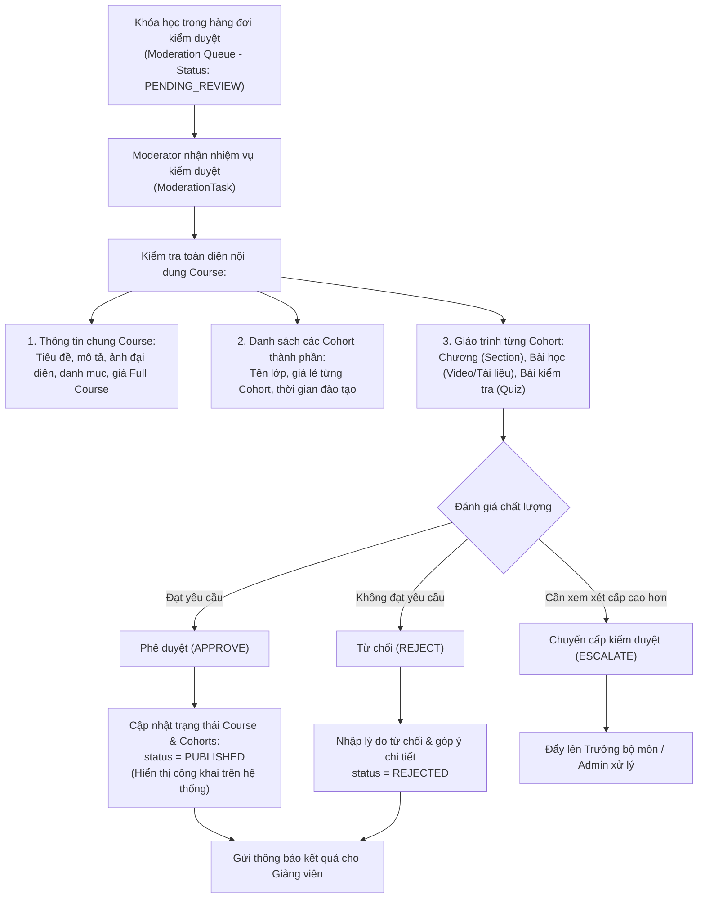
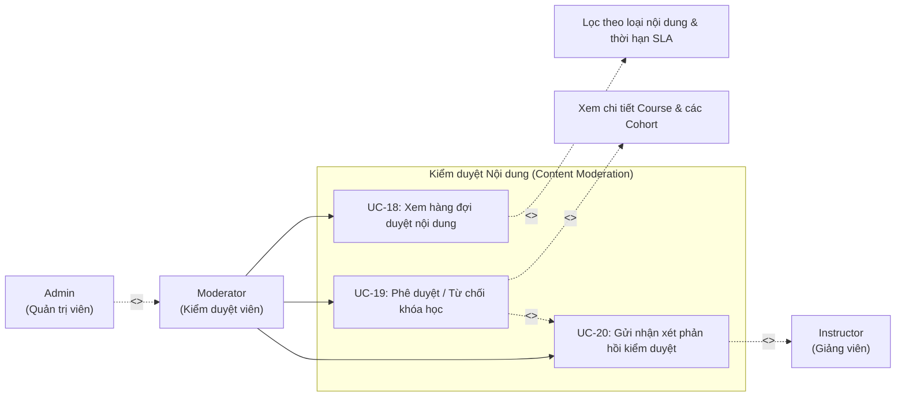

# UC04 – Kiểm duyệt Nội dung (Content Moderation)

## 1. Luồng Kiểm duyệt Khóa học & Cohort

---

## 2. Use Case Diagram

---

## 3. Chi tiết Use Case

### UC-18: Xem hàng đợi duyệt nội dung

| Thuộc tính | Chi tiết mô tả |
|------------|----------------|
| **Mã Use Case** | UC-18 |
| **Tên Use Case** | Xem hàng đợi duyệt nội dung (View Moderation Queue) |
| **Actor chính** | Moderator |
| **Permission** | `CONTENT_APPROVE` |
| **Tiền điều kiện** | Moderator đã đăng nhập và đã điểm danh ca trực trong ngày (`moderator_attendances.is_active = true`). |
| **Mô tả** | Moderator xem danh sách các nội dung đào tạo (Course, Cohort, bài giảng) đang chờ duyệt, lọc theo độ ưu tiên và thời hạn xử lý (SLA). |
| **Luồng sự kiện chính** | 1. Moderator truy cập vào `/moderator/queue`. 2. Hệ thống kiểm tra ca trực đang hoạt động của Moderator. 3. Hiển thị danh sách nhiệm vụ kiểm duyệt (`moderation_tasks`): &nbsp;&nbsp;&nbsp;&nbsp;- Mã task, Tên khóa học, Giảng viên tạo, Ngày gửi duyệt. &nbsp;&nbsp;&nbsp;&nbsp;- Thời gian ước tính cần kiểm duyệt (`estimated_review_minutes`). &nbsp;&nbsp;&nbsp;&nbsp;- Hạn chót xử lý (`deadline_at` theo cam kết chất lượng dịch vụ SLA). &nbsp;&nbsp;&nbsp;&nbsp;- Trạng thái (`PENDING`, `IN_REVIEW`, `ESCALATED`). 4. Moderator lọc theo danh mục, ngày gửi, hoặc tìm kiếm theo tên khóa học. 5. Moderator chọn một task để bắt đầu kiểm duyệt. |
| **Luồng ngoại lệ** | - Moderator chưa điểm danh vào ca trực -> Hệ thống yêu cầu điểm danh trước khi truy cập hàng đợi. |
| **Hậu điều kiện** | Task được gán cho Moderator (`status = IN_REVIEW`, `assigned_to = moderatorId`). |

---

### UC-19: Phê duyệt / Từ chối khóa học

| Thuộc tính | Chi tiết mô tả |
|------------|----------------|
| **Mã Use Case** | UC-19 |
| **Tên Use Case** | Phê duyệt / Từ chối khóa học (Approve or Reject Course) |
| **Actor chính** | Moderator |
| **Permission** | `CONTENT_APPROVE` |
| **Tiền điều kiện** | Moderator đang mở nhiệm vụ kiểm duyệt khóa học cụ thể. |
| **Mô tả** | Đánh giá toàn diện nội dung khóa học và các Cohort cấu thành, đưa ra quyết định duyệt để mở bán công khai hoặc từ chối kèm góp ý. |
| **Luồng sự kiện chính** | 1. Moderator xem trang chi tiết kiểm duyệt của khóa học: &nbsp;&nbsp;&nbsp;&nbsp;- Kiểm tra thông tin giới thiệu, hình ảnh thumbnail, giá Full Course. &nbsp;&nbsp;&nbsp;&nbsp;- Kiểm tra danh sách các Cohort thành phần, giá lẻ từng Cohort. &nbsp;&nbsp;&nbsp;&nbsp;- Duyệt cây giáo trình từng Cohort: Xem video bài giảng, nội dung văn bản, cấu trúc đề thi trắc nghiệm. 2. Đưa ra quyết định: &nbsp;&nbsp;&nbsp;&nbsp;- **Trường hợp Phê duyệt (Approve)**: Nhấn "Phê duyệt khóa học" -> Trạng thái Course và các Cohort chuyển thành `PUBLISHED`. Khóa học lập tức hiển thị công khai trên trang chủ và danh mục tìm kiếm. &nbsp;&nbsp;&nbsp;&nbsp;- **Trường hợp Từ chối (Reject)**: Nhấn "Từ chối khóa học" -> Kích hoạt UC-20 để nhập lý do và hướng dẫn sửa đổi. &nbsp;&nbsp;&nbsp;&nbsp;- **Trường hợp Chuyển cấp (Escalate)**: Khi nội dung phức tạp hoặc có tranh chấp bản quyền -> Chuyển nhiệm vụ lên Trưởng bộ môn / Admin (`escalation_level = 2`). 3. Hệ thống cập nhật bảng `moderation_tasks` sang `APPROVED` hoặc `REJECTED`, ghi nhận thời gian hoàn tất và cộng điểm năng suất ca trực của Moderator. |
| **Ràng buộc nghiệp vụ** | **Chống tự kiểm duyệt**: Giảng viên không được phép tự kiểm duyệt khóa học do chính mình tạo ra (`author_id <> assigned_to`). |
| **Hậu điều kiện** | Trạng thái khóa học được cập nhật chính xác trên toàn hệ thống. |

---

### UC-20: Gửi nhận xét phản hồi kiểm duyệt

| Thuộc tính | Chi tiết mô tả |
|------------|----------------|
| **Mã Use Case** | UC-20 |
| **Tên Use Case** | Gửi nhận xét phản hồi kiểm duyệt (Provide Moderation Feedback) |
| **Actor chính** | Moderator |
| **Actor nhận** | Instructor |
| **Tiền điều kiện** | Khóa học bị từ chối hoặc cần yêu cầu chỉnh sửa bổ sung. |
| **Mô tả** | Gửi văn bản phản hồi chi tiết nêu rõ các điểm chưa đạt yêu cầu (chất lượng âm thanh video, bản quyền, tính chính xác của bài kiểm tra, cấu hình giá) để giảng viên chỉnh sửa. |
| **Luồng sự kiện chính** | 1. Khi Moderator chọn Từ chối khóa học, màn hình hiển thị form nhập phản hồi kiểm duyệt. 2. Moderator nhập các thông tin: &nbsp;&nbsp;&nbsp;&nbsp;- Lý do từ chối chính (chọn từ danh mục vi phạm: Chất lượng nội dung kém, Vi phạm bản quyền, Lỗi kỹ thuật video, Sai cấu trúc đề thi, Giá chưa hợp lý). &nbsp;&nbsp;&nbsp;&nbsp;- Góp ý chi tiết (`feedback` - hỗ trợ định dạng danh sách, dẫn link bài học cụ thể cần sửa). 3. Nhấn **"Xác nhận từ chối và gửi phản hồi"**. 4. Hệ thống lưu nội dung phản hồi vào `moderation_tasks.feedback`. 5. Hệ thống gửi thông báo Notification và email cho Giảng viên sở hữu khóa học. 6. Giảng viên mở khóa học sẽ thấy banner thông báo lý do từ chối và các điểm cần khắc phục trước khi gửi duyệt lại. |
| **Hậu điều kiện** | Giảng viên nắm rõ nguyên nhân từ chối và tiến hành sửa đổi khóa học. |
