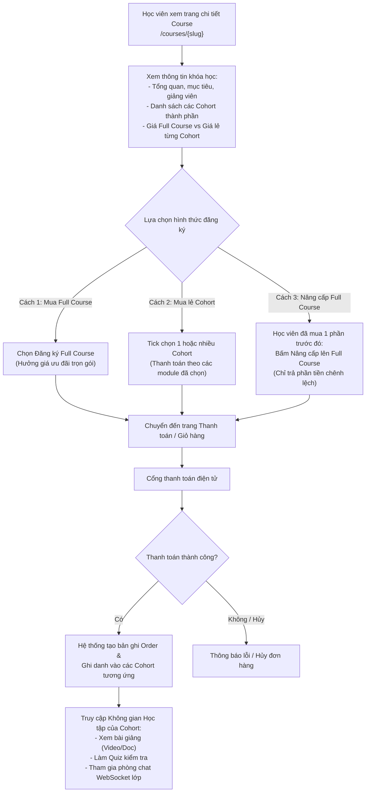
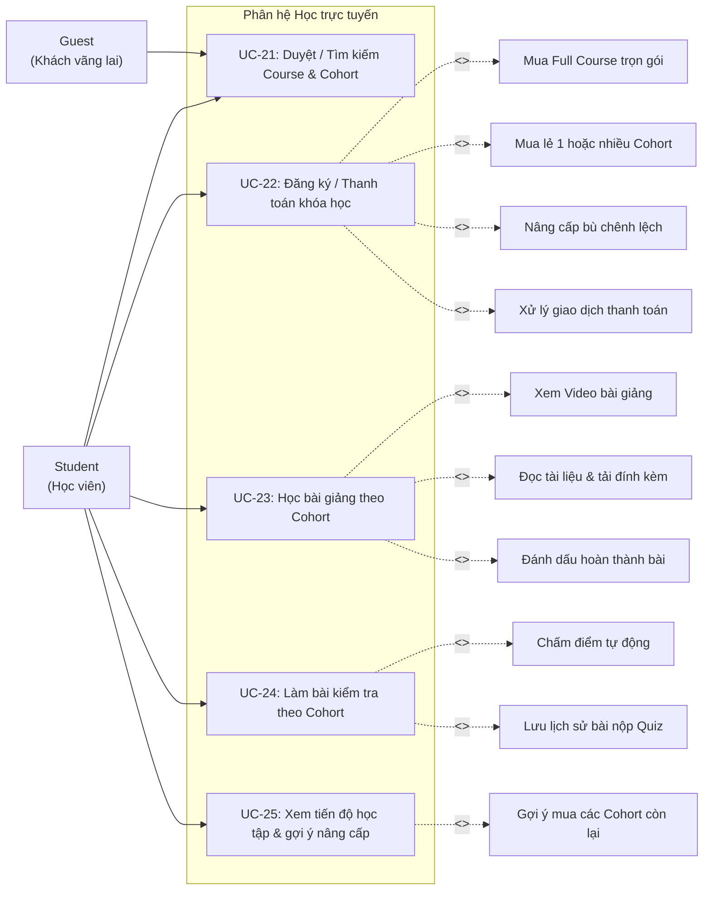

# UC05 – Học trực tuyến (Student Learning Module)

## 1. Luồng Nghiệp vụ Đăng ký & Mua học tập

---

## 2. Use Case Diagram

---

## 3. Chi tiết Use Case

### UC-21: Duyệt / Tìm kiếm Course & Cohort

| Thuộc tính | Chi tiết mô tả |
|------------|----------------|
| **Mã Use Case** | UC-21 |
| **Tên Use Case** | Duyệt / Tìm kiếm Course & Cohort (Browse & Search Courses) |
| **Actor chính** | Guest, Student |
| **Mô tả** | Người dùng xem danh mục, tìm kiếm và xem chi tiết khóa học cùng các lớp học / module thành phần (Cohort). |
| **Luồng sự kiện chính** | 1. Người dùng truy cập trang chủ `/home` hoặc `/courses`. 2. Hệ thống hiển thị danh sách các khóa học đã được xuất bản (`status = PUBLISHED`). 3. Người dùng lọc theo: Danh mục (Category), Cấp độ (Beginner/Intermediate/Advanced), Từ khóa tìm kiếm, Khoảng giá. 4. Người dùng bấm vào một khóa học để xem trang chi tiết `/courses/{slug}`: &nbsp;&nbsp;&nbsp;&nbsp;- Tiêu đề, headline, mô tả chi tiết, giảng viên phụ trách, đánh giá. &nbsp;&nbsp;&nbsp;&nbsp;- Danh sách toàn bộ các Cohort thành phần thuộc Course. &nbsp;&nbsp;&nbsp;&nbsp;- Với mỗi Cohort: Tên module, số lượng bài học, thời lượng, giá mua lẻ, giảng viên/trợ giảng. &nbsp;&nbsp;&nbsp;&nbsp;- So sánh giá Full Course (ưu đãi) vs Tổng giá mua lẻ từng Cohort. &nbsp;&nbsp;&nbsp;&nbsp;- Xem thử miễn phí các bài học có gắn cờ `is_free_preview`. |
| **Hậu điều kiện** | Người dùng nắm rõ thông tin và sẵn sàng chọn mua theo nhu cầu. |

---

### UC-22: Đăng ký / Thanh toán khóa học

| Thuộc tính | Chi tiết mô tả |
|------------|----------------|
| **Mã Use Case** | UC-22 |
| **Tên Use Case** | Đăng ký / Thanh toán khóa học (Course & Cohort Enrollment) |
| **Actor chính** | Student |
| **Tiền điều kiện** | Học viên đã đăng nhập tài khoản. |
| **Mô tả** | Học viên chọn phương thức thanh toán: Mua Full Course trọn gói, mua lẻ 1 hoặc nhiều Cohort, hoặc nâng cấp bù chênh lệch. |
| **Luồng sự kiện chính** | 1. Tại trang chi tiết khóa học, học viên chọn hình thức đăng ký: &nbsp;&nbsp;&nbsp;&nbsp;- **Mua Full Course**: Nhấn "Đăng ký trọn bộ" -> Giá tính theo giá trọn gói của Course. &nbsp;&nbsp;&nbsp;&nbsp;- **Mua lẻ Cohort**: Chọn các checkbox của 1 hoặc nhiều Cohort muốn học -> Tổng tiền bằng tổng giá các Cohort đã chọn. &nbsp;&nbsp;&nbsp;&nbsp;- **Nâng cấp lên Full Course**: Dành cho học viên đã mua 1 số Cohort trước đó -> Hệ thống tính `Số tiền nâng cấp = Giá Full Course - Tổng tiền đã thanh toán các Cohort trước`. 2. Hệ thống tạo đơn hàng (`orders`) ở trạng thái `PENDING`. 3. Học viên chọn phương thức thanh toán (VNPAY / Thẻ tín dụng / Ví điện tử / Mã chuyển khoản). 4. Học viên hoàn tất thanh toán. 5. Cổng thanh toán gửi Webhook xác nhận giao dịch thành công. 6. Hệ thống cập nhật đơn hàng sang `SUCCESS`, thêm học viên vào danh sách thành viên (`cohort_members`) của tất cả các Cohort được mua. 7. Hệ thống chuyển hướng học viên đến không gian học tập kèm thông báo chúc mừng. |
| **Luồng ngoại lệ** | - Thanh toán thất bại hoặc timeout -> Trạng thái đơn hàng `FAILED`, thông báo cho học viên thử lại. - Cohort đã hết sĩ số -> Chặn thanh toán Cohort đó và báo người dùng. |
| **Hậu điều kiện** | Học viên được cấp quyền truy cập đầy đủ vào các Cohort đã mua. |

---

### UC-23: Học bài giảng theo Cohort

| Thuộc tính | Chi tiết mô tả |
|------------|----------------|
| **Mã Use Case** | UC-23 |
| **Tên Use Case** | Học bài giảng theo Cohort (Study Lessons within Cohort) |
| **Actor chính** | Student |
| **Actor hỗ trợ** | TA, Instructor |
| **Tiền điều kiện** | Học viên đã được ghi danh vào Cohort đó (qua mua lẻ Cohort hoặc mua Full Course). |
| **Mô tả** | Học viên truy cập nội dung giáo trình của Cohort, xem video bài giảng, đọc tài liệu, và đánh dấu hoàn thành bài học. |
| **Luồng sự kiện chính** | 1. Học viên vào trang học tập của Cohort. 2. Sidebar hiển thị cây giáo trình gồm các Section và Lesson của Cohort đó. 3. Học viên chọn một bài học để học: &nbsp;&nbsp;&nbsp;&nbsp;- **Bài học Video**: Hệ thống phát trình phát video, ghi nhận thời gian xem. &nbsp;&nbsp;&nbsp;&nbsp;- **Bài học Tài liệu (Document)**: Hiển thị nội dung văn bản định dạng phong phú, cho phép tải tài liệu đính kèm. 4. Khi học xong, học viên nhấn **"Đánh dấu đã hoàn thành"**. 5. Hệ thống ghi nhận tiến độ học tập và tự động chuyển sang bài học tiếp theo. |
| **Luồng ngoại lệ** | - Bài học chưa đến thời điểm mở (`unlock_at` trong tương lai theo lịch của Cohort) -> Hệ thống hiển thị biểu tượng khóa kèm thời gian sẽ mở bài. |
| **Hậu điều kiện** | Tiến độ học tập của học viên được cập nhật vào hệ thống. |

---

### UC-24: Làm bài kiểm tra theo Cohort

| Thuộc tính | Chi tiết mô tả |
|------------|----------------|
| **Mã Use Case** | UC-24 |
| **Tên Use Case** | Làm bài kiểm tra theo Cohort (Take Cohort Assessment Quiz) |
| **Actor chính** | Student |
| **Tiền điều kiện** | Học viên đã mua Cohort chứa Quiz đó và bài kiểm tra đã mở theo lịch học. |
| **Mô tả** | Học viên làm bài kiểm tra trắc nghiệm trong Cohort với thời gian đếm ngược và nhận kết quả chấm tự động. |
| **Luồng sự kiện chính** | 1. Học viên mở bài kiểm tra Quiz trong Cohort. 2. Màn hình tóm tắt thông tin: Số lượng câu hỏi, thời gian làm bài (`duration_minutes`), điểm đạt tối thiểu (`passing_score`), số lần làm bài cho phép. 3. Học viên nhấn **"Bắt đầu làm bài"**. 4. Hệ thống tải đề thi (ngẫu nhiên hóa thứ tự câu hỏi nếu cấu hình `shuffle_questions = true`), khởi động đồng hồ đếm ngược. 5. Học viên chọn đáp án cho từng câu hỏi. 6. Học viên nhấn **"Nộp bài"** (hoặc hệ thống tự nộp khi hết giờ). 7. Hệ thống tự động chấm điểm bài nộp dựa trên bộ đáp án chính xác. 8. Lưu bản ghi vào bảng `quiz_submissions`. 9. Hiển thị kết quả điểm số, trạng thái Đạt/Chưa đạt, và lời giải chi tiết (nếu giảng viên bật quyền xem lời giải). |
| **Luồng ngoại lệ** | - Mất kết nối mạng -> Hệ thống tự động lưu tạm câu trả lời trên trình duyệt (Local Storage) để học viên nộp lại khi có mạng. |
| **Hậu điều kiện** | Kết quả điểm bài kiểm tra được ghi nhận vào hồ sơ học tập của học viên trong Cohort. |

---

### UC-25: Xem tiến độ học tập & gợi ý nâng cấp

| Thuộc tính | Chi tiết mô tả |
|------------|----------------|
| **Mã Use Case** | UC-25 |
| **Tên Use Case** | Xem tiến độ học tập & gợi ý nâng cấp (Learning Progress & Upgrade Upsell) |
| **Actor chính** | Student |
| **Mô tả** | Học viên theo dõi tổng quan tiến độ các khóa học, xem % hoàn thành từng Cohort, và nhận gợi ý nâng cấp lên Full Course. |
| **Luồng sự kiện chính** | 1. Học viên truy cập Dashboard học tập cá nhân `/student/my-courses`. 2. Hệ thống hiển thị danh sách các Course đã tham gia: &nbsp;&nbsp;&nbsp;&nbsp;- Với mỗi Course: Hiển thị các Cohort đã sở hữu kèm thanh tiến độ % hoàn thành bài học và điểm trung bình các Quiz. &nbsp;&nbsp;&nbsp;&nbsp;- Nếu học viên mới chỉ mua một phần số Cohort trong Course đó: Hệ thống hiển thị mục **"Các Cohort tiếp theo trong lộ trình"** kèm nút **"Nâng cấp trọn bộ Full Course"** với mức giá ưu đãi khấu trừ số tiền đã mua. 3. Học viên có thể click vào bất kỳ Cohort nào đã mua để tiếp tục học ngay tại vị trí bài học gần nhất. |
| **Hậu điều kiện** | Học viên nắm bắt tiến độ và có thể dễ dàng ra quyết định nâng cấp tiếp tục học. |
