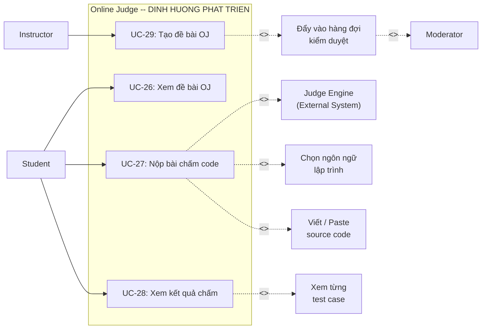

# UC06 – Online Judge (OJ) – DINH HUONG PHAT TRIEN

> **Lưu ý:** Module Online Judge hiện là **định hướng phát triển** trong tương lai.
> Các Use Case dưới đây mô tả chức năng dự kiến, chưa được triển khai trong phiên bản hiện tại.

## Use Case Diagram

## Chi tiết Use Case (Dự kiến)

### UC-26: Xem đề bài OJ

| Thuộc tính | Mô tả |
|------------|--------|
| **Trạng thái** | Định hướng phát triển |
| **Actor** | Student |
| **Mô tả** | Duyệt và xem danh sách đề bài lập trình |
| **Luồng chính** | 1. Student truy cập trang OJ   2. Xem danh sách problems (filter theo difficulty, tag)   3. Click vào problem -> Xem:   - Mô tả đề bài   - Input / Output format   - Constraints   - Sample test cases |
| **Dữ liệu** | `CodingProblem`: title, description, difficulty, time/memory limit |

### UC-27: Nộp bài chấm code

| Thuộc tính | Mô tả |
|------------|--------|
| **Trạng thái** | Định hướng phát triển |
| **Actor** | Student |
| **Permission** | `CODE_SUBMIT` |
| **Mô tả** | Submit source code để chấm tự động |
| **Luồng chính** | 1. Student chọn ngôn ngữ lập trình (Java/C++/Python...)   2. Viết hoặc paste code vào editor   3. Click "Submit"   4. Hệ thống gửi code đến Judge Engine   5. Judge chạy code với các test case   6. Trả về kết quả |
| **Hậu điều kiện** | Bản ghi `CodingSubmission` được tạo |

### UC-28: Xem kết quả chấm

| Thuộc tính | Mô tả |
|------------|--------|
| **Trạng thái** | Định hướng phát triển |
| **Actor** | Student |
| **Mô tả** | Xem kết quả submission sau khi chấm |
| **Luồng chính** | 1. Student xem lịch sử submissions   2. Mỗi submission hiển thị:   - Status: AC / WA / TLE / RE / CE   - Thời gian chạy, bộ nhớ sử dụng   - Kết quả từng test case (nếu cho phép) |
| **Trạng thái kết quả** | `ACCEPTED`, `WRONG_ANSWER`, `TIME_LIMIT_EXCEEDED`, `RUNTIME_ERROR`, `COMPILATION_ERROR` |

### UC-29: Tạo đề bài OJ

| Thuộc tính | Mô tả |
|------------|--------|
| **Trạng thái** | Định hướng phát triển |
| **Actor** | Instructor |
| **Mô tả** | Tạo đề bài lập trình mới cho Online Judge |
| **Luồng chính** | 1. Instructor truy cập trang tạo đề OJ   2. Nhập: title, description, difficulty, tags   3. Cấu hình: time limit, memory limit   4. Thêm test cases (input/output)   5. Submit -> Đẩy vào hàng đợi kiểm duyệt |
| **Hậu điều kiện** | Đề bài ở trạng thái PENDING, chờ Moderator duyệt |
