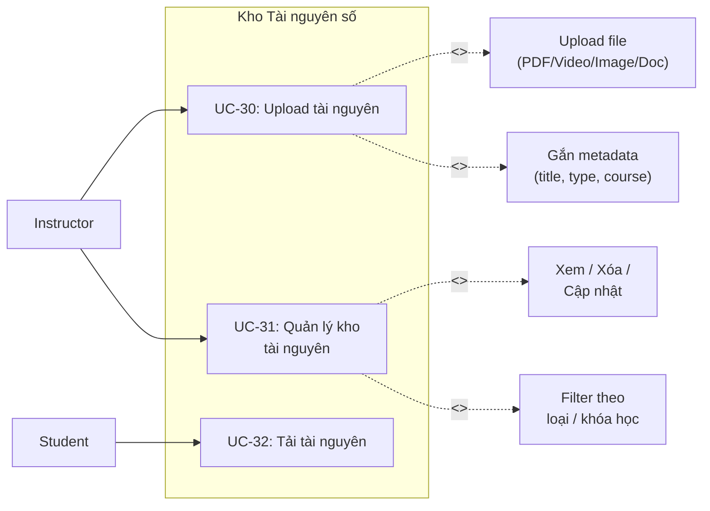

# UC07 – Quản lý Tài nguyên số (Instructor Asset Management)

## Use Case Diagram

## Chi tiết Use Case

### UC-30: Upload tài nguyên

| Thuộc tính | Mô tả |
|------------|--------|
| **Actor** | Instructor |
| **Permission** | `ASSET_MANAGE` |
| **Mô tả** | Upload file tài liệu, video, hình ảnh vào kho cá nhân |
| **Luồng chính** | 1. Instructor truy cập `/instructor/assets`   2. Click "Upload"   3. Chọn file từ máy tính   4. Nhập metadata: title, type (PDF/VIDEO/IMAGE/DOCUMENT), mô tả   5. Liên kết với khóa học (optional)   6. Submit -> File được lưu trữ |
| **Giới hạn** | Kích thước tối đa theo cấu hình hệ thống |
| **Dữ liệu** | `InstructorAsset`: fileName, fileType, fileSize, storagePath |

### UC-31: Quản lý kho tài nguyên

| Thuộc tính | Mô tả |
|------------|--------|
| **Actor** | Instructor |
| **Permission** | `ASSET_MANAGE` |
| **Mô tả** | Xem, sửa, xóa tài nguyên đã upload |
| **Luồng chính** | 1. Instructor truy cập `/instructor/assets`   2. Xem danh sách tài nguyên (phân trang)   3. Filter theo: type, khóa học liên kết   4. Actions:   - **Xem**: Preview/Download file   - **Sửa**: Đổi title, mô tả   - **Xóa**: Xóa file và bản ghi |
| **Luồng ngoại lệ** | - File đang được sử dụng trong Lesson -> Cảnh báo trước khi xóa |

### UC-32: Tải tài nguyên

| Thuộc tính | Mô tả |
|------------|--------|
| **Actor** | Student (đã đăng ký khóa học) |
| **Tiền điều kiện** | Student đã enroll vào khóa học chứa tài nguyên |
| **Mô tả** | Tải file tài nguyên đính kèm trong bài giảng |
| **Luồng chính** | 1. Student đang học Lesson có file đính kèm   2. Click "Tải xuống"   3. Hệ thống kiểm tra quyền truy cập   4. Serve file qua `/assets/download/{id}` |
| **Luồng ngoại lệ** | - Chưa đăng ký -> 403 Forbidden |
