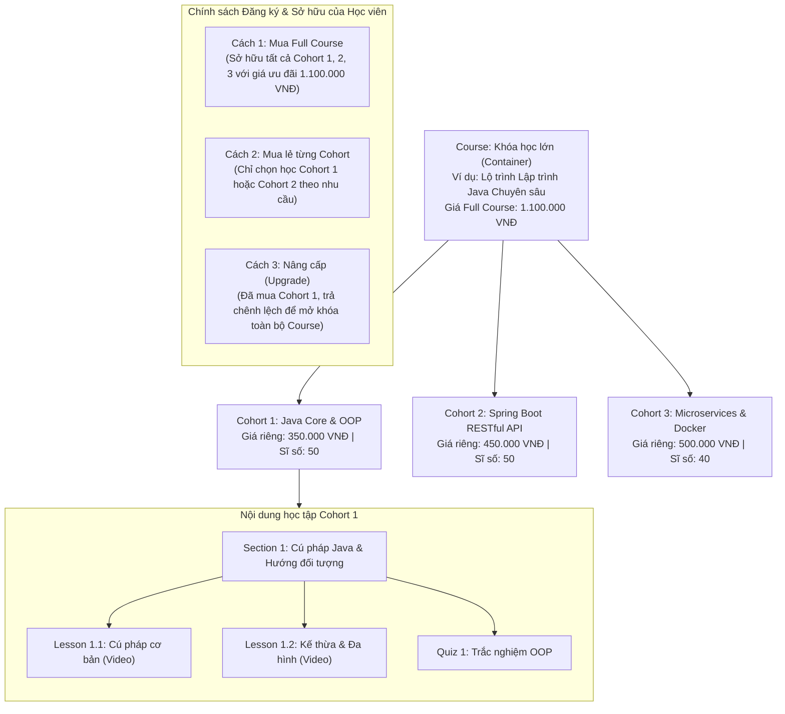
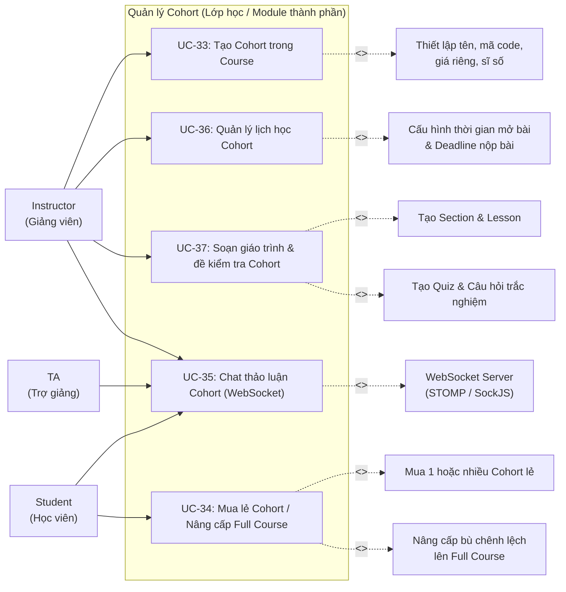
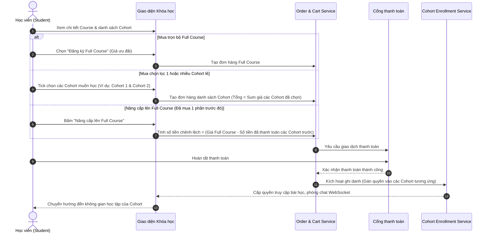

# UC08 – Quản lý Cohort (Lớp học / Module trong Course)

## 1. Mô hình Quan hệ Khóa học (Course) - Cohort

---

## 2. Use Case Diagram

---

## 3. Luồng Nghiệp vụ Nâng cấp và Mua Hàng (Course & Cohort Purchase Flow)

---

## 4. Chi tiết Use Case

### UC-33: Tạo Cohort trong Course

| Thuộc tính | Chi tiết mô tả |
|------------|----------------|
| **Mã Use Case** | UC-33 |
| **Tên Use Case** | Tạo Cohort trong Course (Create Cohort within Course) |
| **Actor chính** | Instructor |
| **Tiền điều kiện** | Khóa học cha (Course) đã được tạo (ở trạng thái `DRAFT` hoặc đang chỉnh sửa). |
| **Mô tả** | Giảng viên tạo thêm một lớp học / module thành phần (Cohort) bên trong Course cha, định nghĩa giá bán lẻ và các thông số hoạt động của lớp. |
| **Luồng sự kiện chính** | 1. Giảng viên vào chi tiết Course, chọn tab **"Danh sách Cohort"**. 2. Nhấn nút **"Thêm Cohort mới"**. 3. Điền các trường thông tin: &nbsp;&nbsp;&nbsp;&nbsp;- Mã lớp (`code` - duy nhất trong hệ thống, VD: `K23-JAVA-01`). &nbsp;&nbsp;&nbsp;&nbsp;- Tên lớp / module (`name` - VD: `Lớp Java Core & OOP`). &nbsp;&nbsp;&nbsp;&nbsp;- Giá bán mua lẻ (`price` - VNĐ, áp dụng khi học viên mua riêng lẻ Cohort này). &nbsp;&nbsp;&nbsp;&nbsp;- Thứ tự hiển thị trong lộ trình (`orderIndex`). &nbsp;&nbsp;&nbsp;&nbsp;- Thời gian mở và đóng đăng ký (`enrollment_start`, `enrollment_end`). &nbsp;&nbsp;&nbsp;&nbsp;- Thời gian học (`study_start`, `study_end`). &nbsp;&nbsp;&nbsp;&nbsp;- Sĩ số tối đa (`max_capacity`, mặc định 50). 4. Nhấn **"Lưu Cohort"**. 5. Hệ thống kiểm tra tính hợp lệ dữ liệu (ngày mở đăng ký < đóng đăng ký, ngày bắt đầu học < kết thúc học, mã duy nhất). 6. Hệ thống tạo bản ghi mới trong bảng `cohorts` liên kết với `course_id`. 7. Tự động thêm Giảng viên vào bảng `cohort_members` với vai trò `TEACHER`. |
| **Luồng ngoại lệ** | - Trùng mã code hoặc khoảng thời gian không hợp lệ -> Hệ thống hiển thị cảnh báo lỗi tương ứng. |
| **Hậu điều kiện** | Cohort mới sẵn sàng để xây dựng nội dung bài học (Section, Lesson, Quiz). |

---

### UC-34: Mua lẻ Cohort / Nâng cấp Full Course

| Thuộc tính | Chi tiết mô tả |
|------------|----------------|
| **Mã Use Case** | UC-34 |
| **Tên Use Case** | Mua lẻ Cohort / Nâng cấp Full Course (Cohort Purchase & Upgrade) |
| **Actor chính** | Student |
| **Tiền điều kiện** | Học viên đã đăng nhập tài khoản UTELearn. |
| **Mô tả** | Cho phép học viên linh hoạt mua 1 hoặc nhiều Cohort theo nhu cầu, hoặc nâng cấp lên gói Full Course để tiết kiệm chi phí. |
| **Luồng sự kiện chính** | 1. Học viên vào trang chi tiết khóa học `/courses/{slug}`. 2. Giao diện hiển thị rõ danh sách các Cohort thành phần, giá riêng từng Cohort và giá ưu đãi Full Course. 3. Học viên thực hiện một trong các thao tác: &nbsp;&nbsp;&nbsp;&nbsp;- **Mua lẻ Cohort**: Tick chọn 1 hoặc nhiều Cohort muốn mua -> Hệ thống tính tổng tiền = tổng giá các Cohort đã tick. &nbsp;&nbsp;&nbsp;&nbsp;- **Mua Full Course**: Bấm nút "Mua trọn bộ Full Course" -> Hệ thống áp dụng mức giá trọn gói ưu đãi. &nbsp;&nbsp;&nbsp;&nbsp;- **Nâng cấp (Upgrade)**: Với học viên đã từng mua 1 vài Cohort trong Course này, hệ thống hiển thị tùy chọn "Nâng cấp lên Full Course" với số tiền chênh lệch = `Giá Full Course - Tổng tiền đã chi trả trước đó`. 4. Học viên xác nhận và tiến hành thanh toán qua cổng thanh toán tích hợp. 5. Khi giao dịch thành công, hệ thống tạo bản ghi `orders`, đồng thời thêm học viên vào `cohort_members` của tất cả các Cohort tương ứng với role `STUDENT`. 6. Tự động tăng biến `current_enrolled` của các Cohort đó. |
| **Luồng ngoại lệ** | - Cohort đã đủ sĩ số tối đa (`current_enrolled >= max_capacity`) -> Thông báo lớp đã đầy, không thể mua lẻ Cohort đó. - Đã qua thời hạn đăng ký (`enrollment_end`) -> Thông báo đợt đăng ký đã kết thúc. |
| **Hậu điều kiện** | Học viên sở hữu quyền truy cập nội dung bài học, nộp bài và vào phòng chat của các Cohort đã mua. |

---

### UC-35: Chat thảo luận Cohort (WebSocket)

| Thuộc tính | Chi tiết mô tả |
|------------|----------------|
| **Mã Use Case** | UC-35 |
| **Tên Use Case** | Chat thảo luận Cohort thời gian thực (Real-time Cohort Chat) |
| **Actor chính** | Student, Teaching Assistant (TA), Instructor |
| **Tiền điều kiện** | Người dùng đã được ghi danh trong Cohort (`cohort_members`). |
| **Mô tả** | Phòng chat trao đổi học tập thời gian thực giữa Giảng viên, Trợ giảng và Học viên trong phạm vi từng Cohort. |
| **Luồng sự kiện chính** | 1. Học viên truy cập không gian học tập của Cohort đã mua. 2. Mở panel chat thảo luận của Cohort. 3. Ứng dụng client thiết lập kết nối WebSocket (STOMP qua SockJS) đến server endpoint `/ws`. 4. Client đăng ký lắng nghe (subscribe) topic của lớp: `/topic/cohort/{cohortId}`. 5. Người dùng nhập tin nhắn và gửi đến `/app/cohort/{cohortId}/send`. 6. Server xác thực quyền thành viên của sender trong Cohort đó, lưu tin nhắn vào bảng `cohort_messages`, và broadcast tin nhắn đến tất cả thành viên đang online trong topic. 7. Giao diện người dùng hiển thị tin nhắn ngay lập tức kèm họ tên, avatar và role của người gửi. |
| **Luồng ngoại lệ** | - Người dùng chưa mua / không thuộc Cohort -> Server từ chối kết nối hoặc gửi tin nhắn (403 Forbidden). |
| **Dữ liệu lưu trữ** | `cohort_messages`: id, cohort_id, sender_id, message, message_type, created_at. |

---

### UC-36: Quản lý lịch học Cohort

| Thuộc tính | Chi tiết mô tả |
|------------|----------------|
| **Mã Use Case** | UC-36 |
| **Tên Use Case** | Quản lý lịch học Cohort (Cohort Schedule & Unlock Management) |
| **Actor chính** | Instructor |
| **Actor xem** | Student, TA |
| **Mô tả** | Thiết lập thời gian mở từng bài học (Lesson Unlock), thời hạn chót nộp bài (Deadline), và chế độ công bố điểm số trong Cohort. |
| **Luồng sự kiện chính** | 1. Giảng viên vào mục **"Lịch học & Điều phối"** của Cohort. 2. Hệ thống liệt kê toàn bộ bài học (Lesson) và bài kiểm tra (Quiz) của Cohort. 3. Với từng bài học, Giảng viên cấu hình: &nbsp;&nbsp;&nbsp;&nbsp;- Thời điểm mở bài (`unlock_at` - học viên chỉ được xem sau thời điểm này). &nbsp;&nbsp;&nbsp;&nbsp;- Hạn nộp bài (`deadline_at` - áp dụng cho bài tập / quiz). &nbsp;&nbsp;&nbsp;&nbsp;- Chế độ xem điểm (`show_score_type`: IMMEDIATELY sau khi nộp, AFTER_DEADLINE, hoặc MANUAL khi GV duyệt). &nbsp;&nbsp;&nbsp;&nbsp;- Cho phép xem lời giải chi tiết (`allow_review_answers`). 4. Nhấn **"Lưu lịch học"**. 5. Dữ liệu được lưu vào bảng `cohort_schedules`. Học viên truy cập lớp học sẽ thấy timeline lịch học trực quan. |
| **Hậu điều kiện** | Bài giảng tự động mở theo đúng lịch trình thiết lập. |

---

### UC-37: Soạn giáo trình & đề kiểm tra Cohort

| Thuộc tính | Chi tiết mô tả |
|------------|----------------|
| **Mã Use Case** | UC-37 |
| **Tên Use Case** | Soạn giáo trình & đề kiểm tra Cohort (Cohort Curriculum & Assessments) |
| **Actor chính** | Instructor |
| **Mô tả** | Xây dựng cây nội dung học tập hoàn chỉnh cho từng Cohort gồm các Section (Chương), Lesson (Bài học) và Quiz (Bài kiểm tra). |
| **Luồng sự kiện chính** | 1. Giảng viên mở giao diện soạn giáo trình của Cohort. 2. **Thao tác Section**: Nhấn "Thêm Section mới", đặt tên chương, kéo thả sắp xếp thứ tự. 3. **Thao tác Lesson**: Trong từng Section, thêm các bài học với loại nội dung tương ứng: &nbsp;&nbsp;&nbsp;&nbsp;- `VIDEO`: Nhập URL video hoặc chọn từ kho tài nguyên (`InstructorAsset`), điền thời lượng. &nbsp;&nbsp;&nbsp;&nbsp;- `DOCUMENT`: Soạn thảo nội dung định dạng phong phú (Rich text / Markdown) hoặc đính kèm tài liệu. &nbsp;&nbsp;&nbsp;&nbsp;- Đánh dấu `is_free_preview` nếu cho phép học viên học thử miễn phí trước khi mua. 4. **Thao tác Quiz**: Tạo bài kiểm tra trắc nghiệm gắn với bài học: &nbsp;&nbsp;&nbsp;&nbsp;- Thiết lập thời gian làm bài (`duration_minutes`), điểm đạt (`passing_score`), số lần làm bài tối đa. &nbsp;&nbsp;&nbsp;&nbsp;- Thêm câu hỏi (nội dung, loại câu hỏi: single choice / multi-select, đáp án, giải thích chi tiết). 5. Giảng viên lưu lại. Toàn bộ nội dung gắn chặt với Cohort đó. |
| **Hậu điều kiện** | Nội dung học tập của Cohort hoàn tất, sẵn sàng cho việc kiểm duyệt và giảng dạy. |
